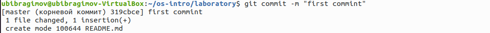
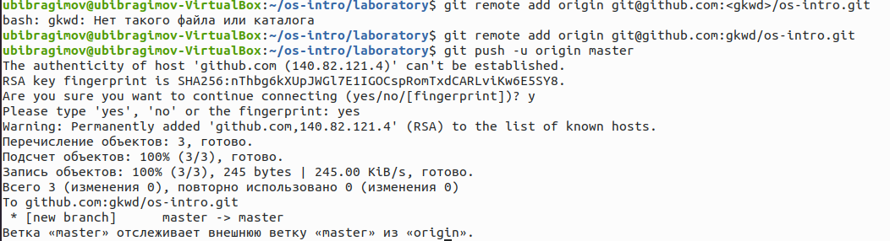
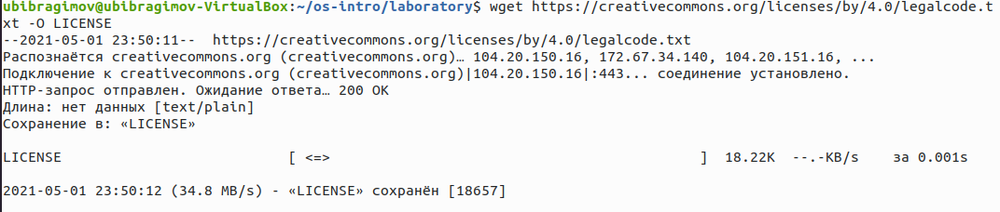
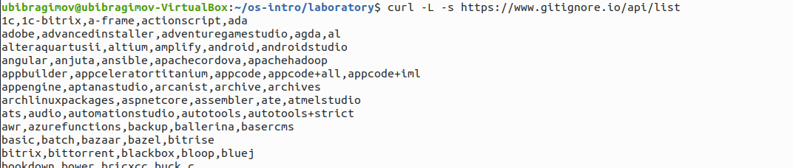
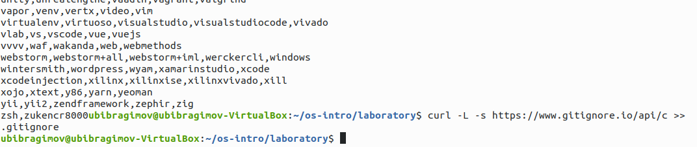
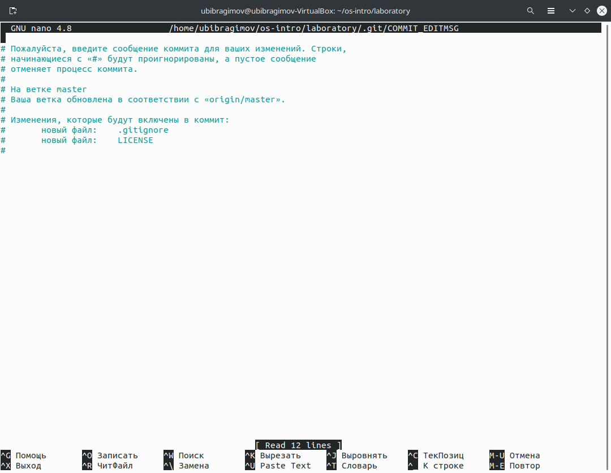
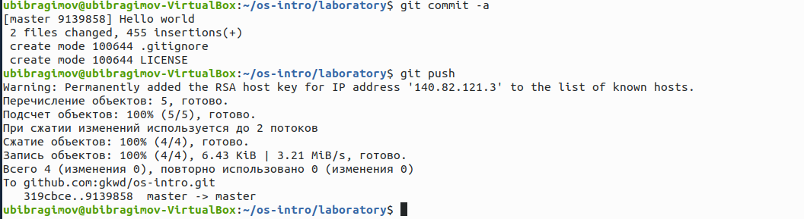
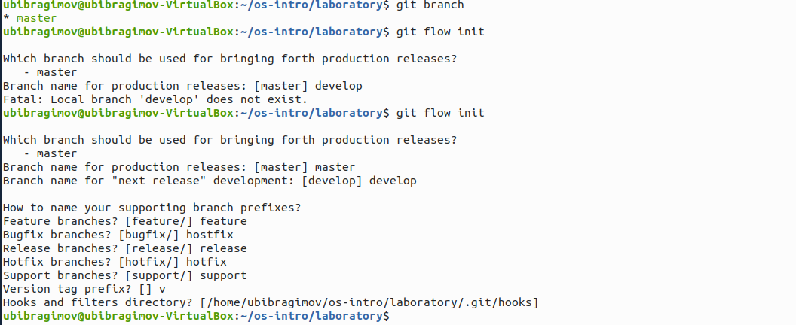
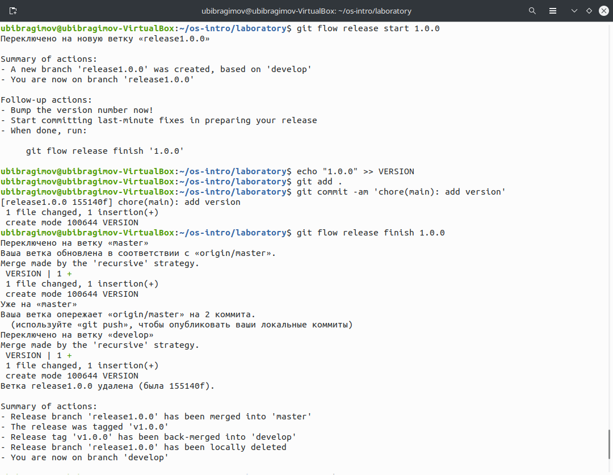
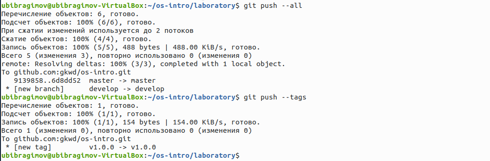

---
# Front matter
lang: ru-Ru
title: "Отчёт по лабораторной работе №2"
author: "Ибрагимов Улугбек Ботырхонович"

# Formatting
toc-title: "Содержание"
toc: true # Table of contents
toc_depth: 2
lof: true # List of figures
lot: true # List of tables
fontsize: 14pt
linestretch: 1.5
papersize: a4paper
documentclass: scrreprt
polyglossia-lang: russian
polyglossia-otherlangs: english
mainfont: PT Serif
romanfont: PT Serif
sansfont: PT Sans
monofont: PT Mono
mainfontoptions: Ligatures=TeX
romanfontoptions: Ligatures=TeX
sansfontoptions: Ligatures=TeX,Scale=MatchLowercase
monofontoptions: Scale=MatchLowercase
indent: true
pdf-engine: lualatex
header-includes:
  - \linepenalty=10 # the penalty added to the badness of each line within a paragraph (no associated penalty node) Increasing the value makes tex try to have fewer lines in the paragraph.
  - \interlinepenalty=0 # value of the penalty (node) added after each line of a paragraph.
  - \hyphenpenalty=50 # the penalty for line breaking at an automatically inserted hyphen
  - \exhyphenpenalty=50 # the penalty for line breaking at an explicit hyphen
  - \binoppenalty=700 # the penalty for breaking a line at a binary operator
  - \relpenalty=500 # the penalty for breaking a line at a relation
  - \clubpenalty=150 # extra penalty for breaking after first line of a paragraph
  - \widowpenalty=150 # extra penalty for breaking before last line of a paragraph
  - \displaywidowpenalty=50 # extra penalty for breaking before last line before a display math
  - \brokenpenalty=100 # extra penalty for page breaking after a hyphenated line
  - \predisplaypenalty=10000 # penalty for breaking before a display
  - \postdisplaypenalty=0 # penalty for breaking after a display
  - \floatingpenalty = 20000 # penalty for splitting an insertion (can only be split footnote in standard LaTeX)
  - \raggedbottom # or \flushbottom
  - \usepackage{float} # keep figures where there are in the text
  - \floatplacement{figure}{H} # keep figures where there are in the text
---

## Титульный лист
Отчёт по лабораторной работе №2
Ибрагимов Улугбек Ботырхонович

## Цель работы
Изучить идеологию и применение средств контроля версий.

## Задание
1. Создайте учётную запись на https://github.com.
2. Настройте систему контроля версий git, как это описано выше c использованием
сервера репозиториев https://github.com/.
3. Создайте структуру каталога лабораторных работ согласно пункту М.2.
4. Подключите репозиторий:
4.1. Создайте репозиторий на GitHub. Для примера назовём его os-intro.
4.2. Рабочий каталог будем обозначать как laboratory. Вначале нужно перейти в этот каталог: `cd laboratory`
4.3. Инициализируем системы git: `git init`
4.4. Создаём заготовку для файла `README.md`:
`echo "# Лабораторные работы" >> README.md git add README.md`
4.5. Делаем первый коммит и выкладываем на github:
`git commit -m "first commit"`
`git remote add origin`
`↪ git@github.com:<username>/sciproc-intro.git`
`git push -u origin master`
5. Первичная конфигурация:
5.1. Добавим файл лицензии: `wget https://creativecommons.org/licenses/by/4.0/legalcode.txt`
`↪ -O LICENSE`
5.2. Добавим шаблон игнорируемых файлов. Просмотрим список имеющихся шаблонов: `curl -L -s https://www.gitignore.io/api/list`
Затем скачаем шаблон, например, для C: `curl -L -s https://www.gitignore.io/api/c >> .gitignore`
5.3. Можно это же сделать через web-интерфейс на сайте `https://www.gitignore.io/.`
5.4. Добавим новые файлы:
`git add .`
5.5. Выполним коммит:
`git commit -a`
5.6. Отправим на github:
`git push`
6. Конфигурация git-flow:
6.1. Инициализируем git-flow
`git flow init`
Префикс для ярлыков установим в v.
6.2. Проверьте, что Вы на ветке `develop`:
`git branch`
6.3. Создадим релиз с версией 1.0.0
`git flow release start 1.0.0`
6.4. Запишем версию:
`echo "1.0.0" >> VERSION`
6.5. Добавим в индекс:
`git add .`
`git commit -am 'chore(main): add version'`
6.6 Зальём релизную ветку в основную ветку
`git flow release finish 1.0.0`
6.7 Отправим данные на github
`git push --all`
`git push --tags`
6.8 Создадим релиз на github

## Ход выполнения работы
1. Создали репозиторий `os-intro` 
2. Создаем рабочий каталог `laboratory`, переходим в него )
3. Инициализируем системы Git, делаем первый коммит в виде файла к README.md ) и )
4. Выкладываем на git )
5. Добавляем лицензию )
6. Скачиваем и добавляем gitignore ) )
7. Публикуем коммиты ) )
8. Инициализурем git-flow и потоки параллельной разработки )
9. Создаем релиз 1.0.0 )
10. Отправим на git )

## Выводы
В ходе выполнения Лабораторной работы №2, были приобретены навыки по администрированию и взаимодействию с децентрализованной системой контроля версий и программой git для параллельной разработки и поддержки программного кода.

## Ответы на контрольные вопросы
1. Что такое системы контроля версий (VCS) и для решения каких задач они предназначаются?
> Ответ: Системы контроля версий (VCS) применяются при работе нескольких человек над одним проектом, совместная работа путем изменения файлов в одном репозитории
2. Объясните следующие понятия VCS и их отношения: хранилище, commit, история, рабочая копия.
> Ответ: 
> + Хранилище - общее пространство для хранения файлов
> + Commit - команда для записииндексированных изменений в репозиторий
> + История - в истории сохраняются все коммиты, по которым можно отследить автора, сообщение, дату и хэш коммита
> + Рабочая копия - все файлы кроме `.git/` называются рабочей копией, и принадлежать пользователю (-лям) 
3. Что представляют собой и чем отличаются централизованные и децентрализованные VCS? Приведите примеры VCS каждого вида.
> Ответ: Централизованные системы контроля версий - сохраняют проект и его файлы на один общий сервер, децентрализованные системы контроля версий - при каждом копировании данных удаленного репозитория, происходит полное копирование данных в локальный репозиторий. Пример ЦСКВ - SVN, MS TFS, ClearCase; ДСКВ - Git, Mercurial, Bazaar. 
4. Опишите действия с VCS при единоличной работе с хранилищем.
> Ответ: 
> 1. Создаем репозиторий, именуем его
> 2. Добавляем файлы в репозиторий
> 3. Фиксируем с помощью коммитов
> 4. Изменяем файлы репозитория и фиксируем изменения
5. Опишите порядок работы с общим хранилищем VCS.
> Ответ: 
> 1. Создаем репозиторий, именуем его или присоединяемся к нему в качестве `contibutor`
> 2. Добавляем файлы в репозиторий
> 3. Фиксируем с помощью коммитов
> 4. Изменяем файлы репозитория и фиксируем изменения
> 5. Ждем проверки коммитов при участии других пользователей в общем репозитории
6. Каковы основные задачи, решаемые инструментальным средством git?
> Ответ: Систематизация, параллельность разработки программного обеспечения, единое место для хранение файлов проекта
7. Назовите и дайте краткую характеристику командам git.
> Ответ: Создание репозитория (`git init`), Клонирование репозитория (`git clone`), Добавление изменений в индекс (`git add`), Удаление изменений из индекса (`git reset`), Коммиты (`git commit`), Удаление файла (`git rm`).
8. Приведите примеры использования при работе с локальным и удалённым репозиториями.
> Ответ: Для написания черновых работ по лабораторным работам я использую локальные репозитории, для их распространения или для оценивания преподователем я использую удаленный репозиторий `git`
9.  Что такое и зачем могут быть нужны ветви (branches)?
> Ответ: Ветви служат для паралельной разработки программного обеспечения, тестирования, отладки и улучшения
10. Как и зачем можно игнорировать некоторые файлы при commit?
> Ответ: Игнорирование можно установить для проекта, компьютера и репозитория, цель игнорирования заключается в том, чтобы неотслеживать файлы служебного типа, например временные файлы сборных утилит для проектов или только те файлы которые полезны при взаимодействии только с очень ограниченным программным обеспечением