---
# Front matter
lang: ru-Ru
title: "Отчёт по лабораторной работе №5"
author: "Ибрагимов Улугбек Ботырхонович"

# Formatting
toc-title: "Содержание"
toc: true # Table of contents
toc_depth: 2
lof: true # List of figures
lot: true # List of tables
fontsize: 14pt
linestretch: 1.5
papersize: a4paper
documentclass: scrreprt
polyglossia-lang: russian
polyglossia-otherlangs: english
mainfont: PT Serif
romanfont: PT Serif
sansfont: PT Sans
monofont: PT Mono
mainfontoptions: Ligatures=TeX
romanfontoptions: Ligatures=TeX
sansfontoptions: Ligatures=TeX,Scale=MatchLowercase
monofontoptions: Scale=MatchLowercase
indent: true
pdf-engine: lualatex
header-includes:
  - \linepenalty=10 # the penalty added to the badness of each line within a paragraph (no associated penalty node) Increasing the value makes tex try to have fewer lines in the paragraph.
  - \interlinepenalty=0 # value of the penalty (node) added after each line of a paragraph.
  - \hyphenpenalty=50 # the penalty for line breaking at an automatically inserted hyphen
  - \exhyphenpenalty=50 # the penalty for line breaking at an explicit hyphen
  - \binoppenalty=700 # the penalty for breaking a line at a binary operator
  - \relpenalty=500 # the penalty for breaking a line at a relation
  - \clubpenalty=150 # extra penalty for breaking after first line of a paragraph
  - \widowpenalty=150 # extra penalty for breaking before last line of a paragraph
  - \displaywidowpenalty=50 # extra penalty for breaking before last line before a display math
  - \brokenpenalty=100 # extra penalty for page breaking after a hyphenated line
  - \predisplaypenalty=10000 # penalty for breaking before a display
  - \postdisplaypenalty=0 # penalty for breaking after a display
  - \floatingpenalty = 20000 # penalty for splitting an insertion (can only be split footnote in standard LaTeX)
  - \raggedbottom # or \flushbottom
  - \usepackage{float} # keep figures where there are in the text
  - \floatplacement{figure}{H} # keep figures where there are in the text
---

***
## Цель работы
Приобретение практических навыков взаимодействия пользователя с системой посредством командной строки.

***
## Выполнение лабораторной работы

***
## 1. Определяем полное имя каталога
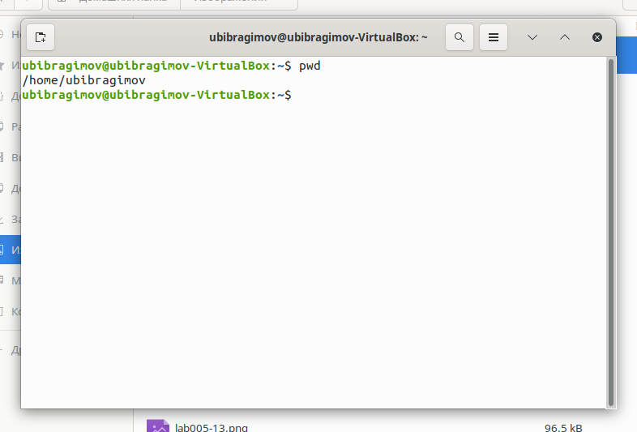

***
## 2. Переходим в каталог /tmp
+ Выводим содержимое  
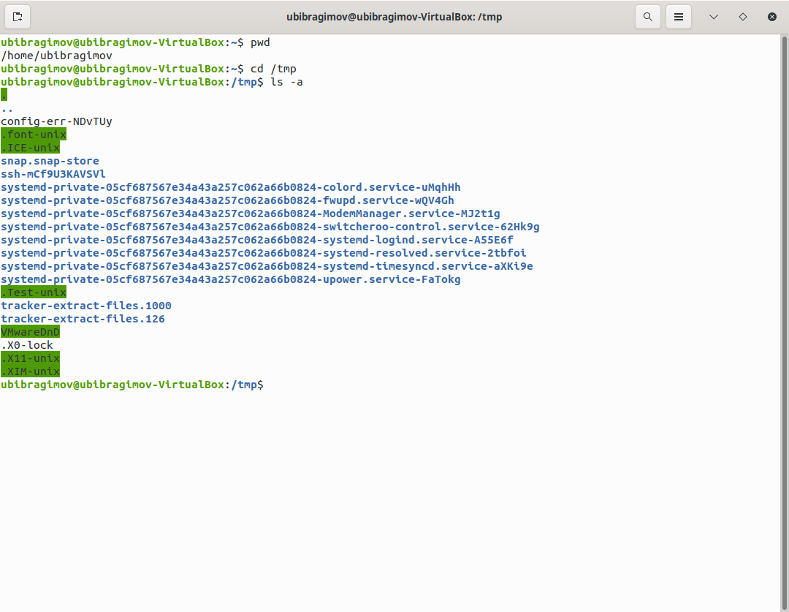
+ Определяем есть ли в каталоге  `/var/spool` подкаталог с именем cron  
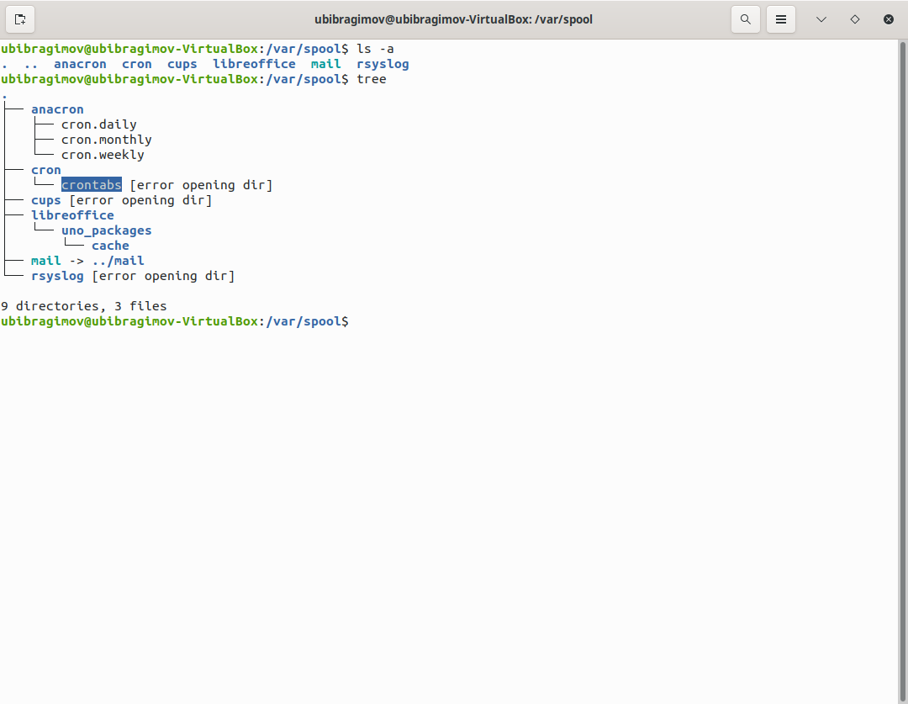
+ Переходим в домашний каталог  и выводим содержимое  
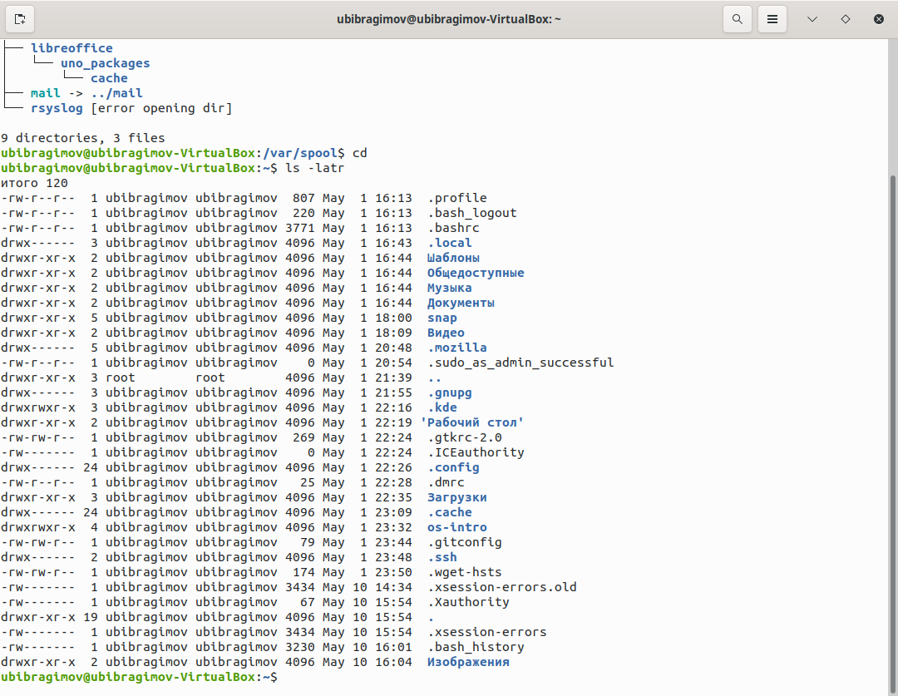

***
## 3. Выполняем след. действия.
+ Создаем каталог с именем `newdir`.
+ В каталоге `~/newdir` создаем новый каталог с именем `morefun`.
+ В домашнем каталоге создаем одной командой три новых каталога с именами `letters, memos, misk`. Затем удаляем эти каталоги одной командой.  
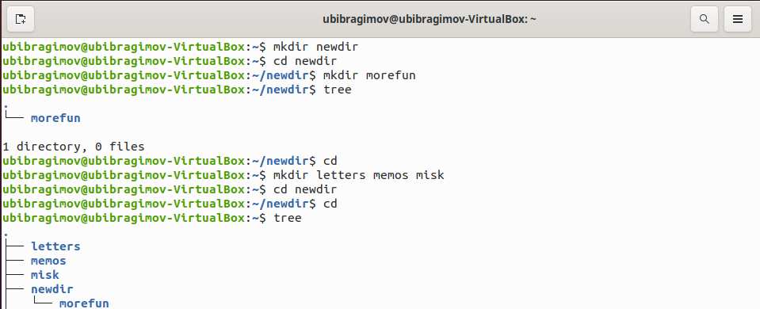
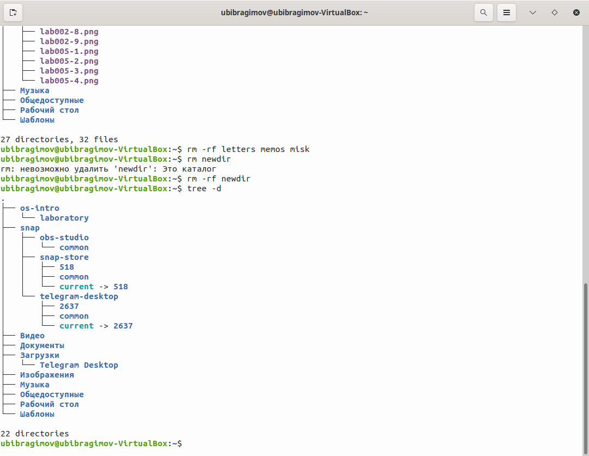
+ Создание прошло успешно.  

+ Попробуем удалить ранее созданный каталог `~/newdir` командой `rm`. Проверим, был ли каталог удалён.  

+ Удаляем каталог `~/newdir/morefun` из домашнего каталога. Проверяем, был ли каталог удалён.  

+ Каталог был удалён.  

***
## 4. С помощью команды man определяем, какую опцию команды ls нужно использовать для просмотра содержимое не только указанного каталога, но  и подкаталогов, входящих в него.

+ Надо использовать опцию `-R -> ls -R`.

***
## 5.  С помощью команды man определяем набор опций команды ls, позволяющий отортировать по времени последнего изменения выводимый список содержимого каталога с развёрнутым описанием файлов.

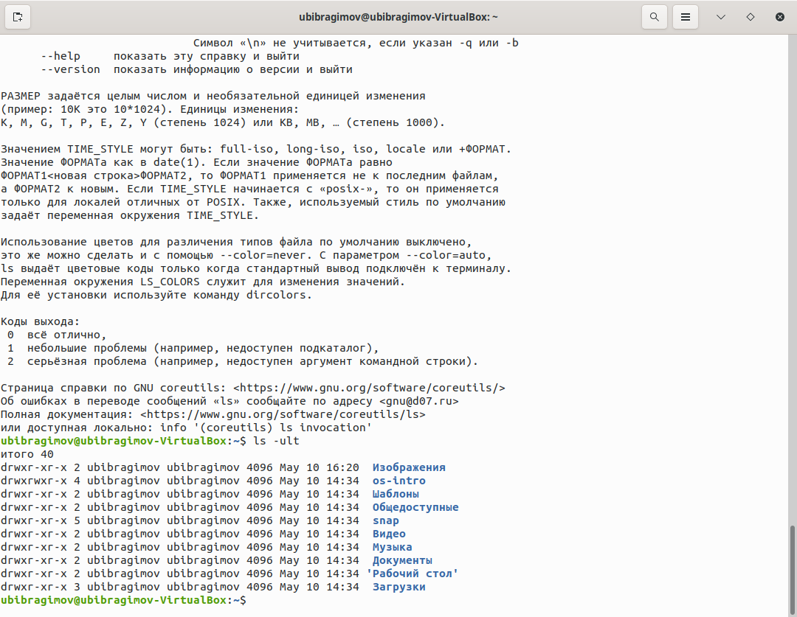
+ Набор опций `-ult` позволяет отсортировать по времени последнего изменения выводимый список содержимого каталога с развёрнутым описанием файлов.

***
## 6. Используем команду man для просмотра описания следующих команд: cd, pwd, mkdir, rmdir, rm.
+ cd  

+ pwd  
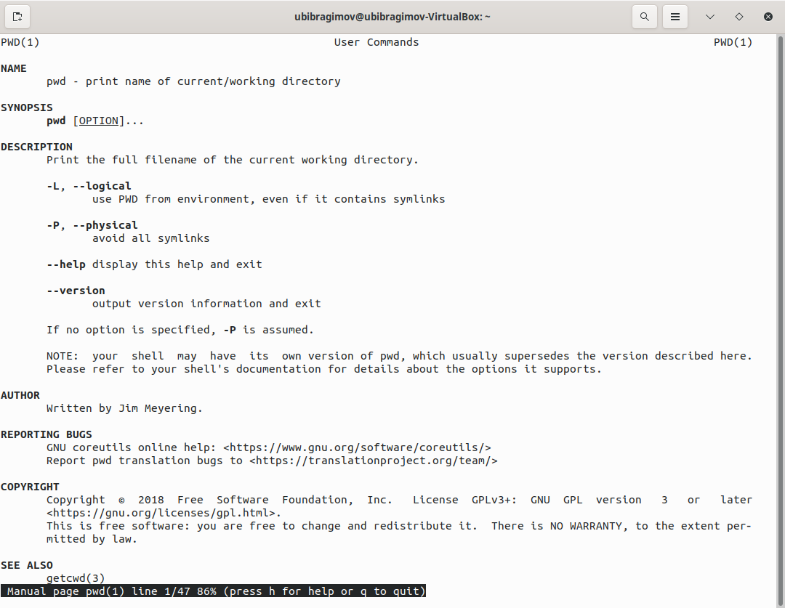
+ mkdir  

+ rmdir  
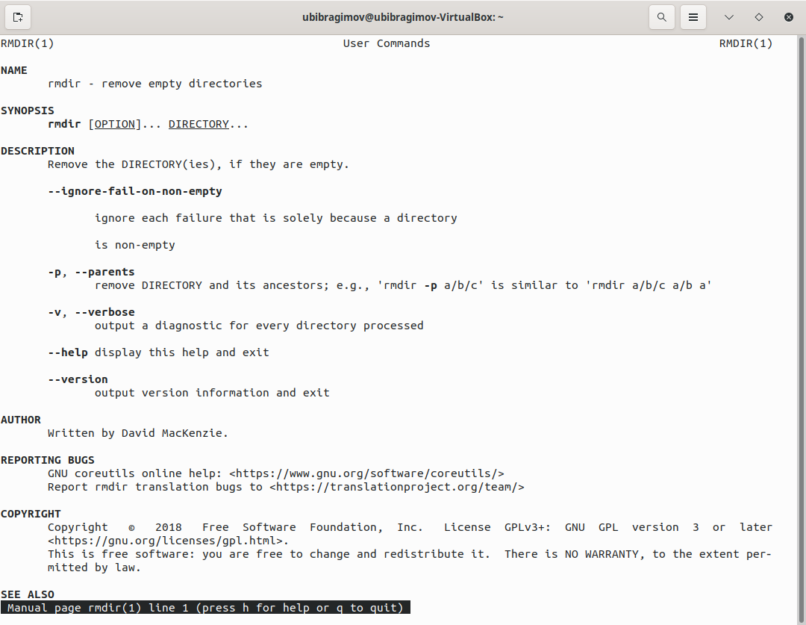
+ rm  
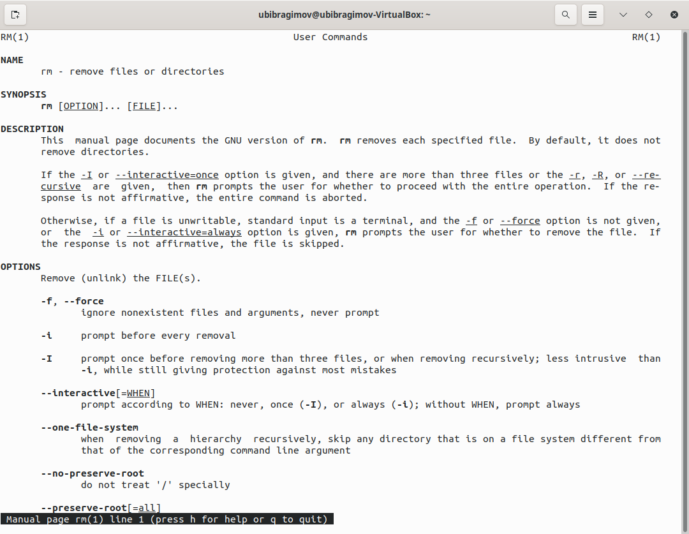

***
## 7. Используя информацию, полученную при помощи команды history, выполните модификацию и исполнение нескольких команд из буфера команд.
+ Выполним команду  history;  
+ Исполним history !325 = cd List;
+ Модифицируем и исполним команды
`ls -R -> ls -l ; man cd -> man pwd ;`  

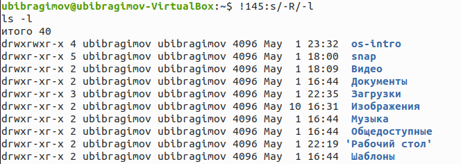

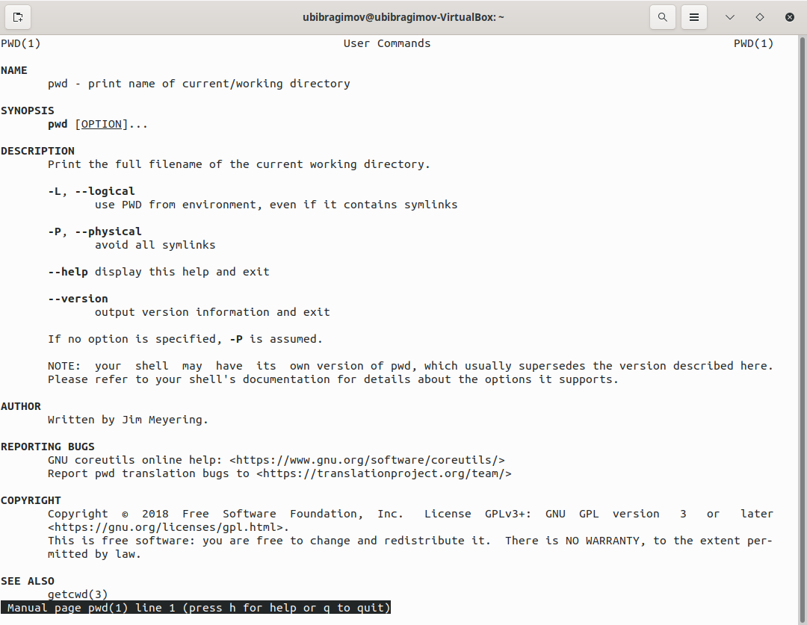

***
## Вывод
В ходе выполнения Лабораторной работы №5, были приобретены навыки по администрированию и взаимодействию с каталогами, файлами и командной строкой

***
## Контрольные вопросы:
1. Командная строка - программа, которая служит промежуточным слоем между человеком и машиной и передает друг другу команды и ответы машине и человеку соответственно
2. Используется команда pwd - `print working directory`
3. При помощи команды `ls (-опции) / tree(-опции)`
4. Скрытые файлы - файлы, которые нежелательны для просмотра, редактирования и перемещения - имеют впереди названия файла точку, чтобы вывести имена скрытых файлов используют `ls -a`
5. Команда `rm` для удаления файла, для удаления папки `rmdir`
6. Используя команду `history`
7. Используя команду `history`, запомнить номер команды, потом написать ошибку и ее замену
8. Для таких случаев используется символ `;`
9. Символ экранирования нужен для того чтобы командная строка не приняла специальные символы `., *, /, ...` за команду
10. `ls -l` показывает дополнительную информацию о  файле - дата изменения, права доступа, список владельцев
11. Относительный путь — путь к файлу к которому не нужно задавать полное местонахождение, а можно обойтись быстым вводом - `text.txt`, при этом файла и терминла должны быть открыты из одного каталога или указать путь `orders/text.txt`
12. Команда `--help`
13. Вводим первые буквы, нажимаем клавишу `Tab`
