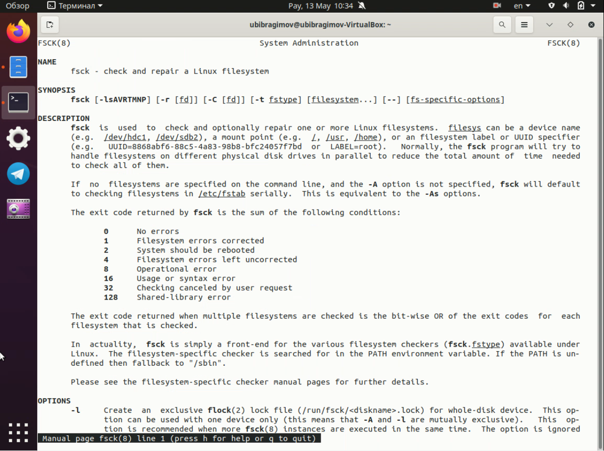

---
# Front matter
lang: ru-Ru
title: "Отчёт по лабораторной работе №6"
author: "Ибрагимов Улугбек Ботырхонович"

# Formatting
toc-title: "Содержание"
toc: true # Table of contents
toc_depth: 2
lof: true # List of figures
lot: true # List of tables
fontsize: 14pt
linestretch: 1.5
papersize: a4paper
documentclass: scrreprt
polyglossia-lang: russian
polyglossia-otherlangs: english
mainfont: PT Serif
romanfont: PT Serif
sansfont: PT Sans
monofont: PT Mono
mainfontoptions: Ligatures=TeX
romanfontoptions: Ligatures=TeX
sansfontoptions: Ligatures=TeX,Scale=MatchLowercase
monofontoptions: Scale=MatchLowercase
indent: true
pdf-engine: lualatex
header-includes:
  - \linepenalty=10 # the penalty added to the badness of each line within a paragraph (no associated penalty node) Increasing the value makes tex try to have fewer lines in the paragraph.
  - \interlinepenalty=0 # value of the penalty (node) added after each line of a paragraph.
  - \hyphenpenalty=50 # the penalty for line breaking at an automatically inserted hyphen
  - \exhyphenpenalty=50 # the penalty for line breaking at an explicit hyphen
  - \binoppenalty=700 # the penalty for breaking a line at a binary operator
  - \relpenalty=500 # the penalty for breaking a line at a relation
  - \clubpenalty=150 # extra penalty for breaking after first line of a paragraph
  - \widowpenalty=150 # extra penalty for breaking before last line of a paragraph
  - \displaywidowpenalty=50 # extra penalty for breaking before last line before a display math
  - \brokenpenalty=100 # extra penalty for page breaking after a hyphenated line
  - \predisplaypenalty=10000 # penalty for breaking before a display
  - \postdisplaypenalty=0 # penalty for breaking after a display
  - \floatingpenalty = 20000 # penalty for splitting an insertion (can only be split footnote in standard LaTeX)
  - \raggedbottom # or \flushbottom
  - \usepackage{float} # keep figures where there are in the text
  - \floatplacement{figure}{H} # keep figures where there are in the text
---

## Цель работы
Ознакомление с файловой системой Linux, её структурой, именами и содержанием каталогов. Приобретение практических навыков по применению команд для работы с файлами и каталогами

## Выполнение лабораторной работы
## 1. Выполняем все примеры, приведённые в первой части описания лабораторной работы.
1.1.  Копирование файла в текущем каталоге. Скопировать файл `~/abc1` в файл `april` и в файл `may`
        
1.2.  Копирование нескольких файлов в каталог. Скопировать файлы `april` и may в каталог `monthly`
1.3.   Копирование файлов в произвольном каталоге. Скопировать файл `monthly/may` в файл с именем `june`
        
1.4.  Копирование каталогов в текущем каталоге. Скопировать каталог `monthly` в каталог `monthly.00`
1.5.  Копирование каталогов в произвольном каталоге. Скопировать каталог
        
1.6.   Переименование файлов в текущем каталоге. Изменить название файла april на july в домашнем каталоге
1.7.   Перемещение файлов в другой каталог. Переместить файл july в каталог monthly.00  
1.8.   Переименование каталогов в текущем каталоге. Переименовать каталог monthly.00 в monthly.01
1.9.   Перемещение каталога в другой каталог. Переместить каталог monthly.01 в каталог reports
1.10.  Переименование каталога, не являющегося текущим. Переименовать каталог reports/monthly.01 в reports/monthly
1.11.  Требуется создать файл ~/may с правом выполнения для владельца
1.12.  Требуется лишить владельца файла ~/may права на выполнение
        
1.13.  Требуется создать каталог monthly с запретом на чтение для членов группы и всех остальных пользователей.
1.14.  Требуется создать файл ~/abc1 с правом записи для членов группы.
## 2. Выполним следующие действия.
2.1.  Скопируем файл /usr/include/search.h в домашний каталог и назовём его equipment.
2.2. В домашнем каталоге создадим директорию ~/ski.plases.
2.3. Переместим файл equipment в каталог ~/ski.plases.
2.4. Переименуем файл ~/ski.plases/equipment в ~/ski.plases/equiplist.
2.5. Создадим в домашнем каталоге файл abc1 и скопируем его в каталог ~/ski.plases, назовём его equiplist2.
2.6. Создадим каталог с именем equipment в каталоге ~/ski.plases.
2.7. Переместим файлы `~/ski.plases/equiplist` и `equiplist2` в каталог `~/ski.plases/equipment`
        
2.8. Создадим и переместим каталог `~/newdir` в каталог `~/ski.plases` и назовём его `plans`.
        

## 3. Определим опции команды chmod, необходимые для того, чтобы присвоить пеечисленным ниже файлам выделенные права доступа, считая, что в начале таких прав нет.
3.1. Создаем каталоги и файлы.
3.2. изменяем права командой `chmod`.
        
        

## 4. Проделем приведённые упражнения.
4.1. Просмотрим содержимое файла `/etc/password` - `sudo cat`
4.2. Скопируем файл `~/feathers` в файл `~/file.old`
4.3. Переместим файл `~/file.old` в каталог `~/play`
4.4. Скопируем каталог `~/play` в каталог `~/fun`
4.5. Переместим каталог `~/fun` в каталог `~/play` и назовём его games
4.6. Лишим владельца файла `~/feathers` права на чтение.
4.7. Просмотрим этот файл с помощью `cat` и 4.8. Попробуем скопировать
4.9.  Дадим владельцу файла `~/feathers` право на чтение.
4.10. Лишим владельца каталога `~/play` права на выполнение.
4.11. Перейдём в каталог `~/play` -> нехватка прав.
4.12. Дадим владельцу каталога `~/play` право на выполнение.
        

## 5. Прочитаем man по командам mount, fsck, mkfs, kill и кратко их охарактеризуем, приведя примеры.
 
5.1. `mount`
        
5.2. `fsck`
        
5.3. `mkfs`
        
5.4. `kill`
        
## Вывод
В ходе выполнения Лабораторной работы №5, были приобретены навыки по использованию команд, копирование каталогов и их удаляние, перемещение файлов и каталогов, копирование файлов и каталогов

## Контрольные вопросы:
1. Ответ:
EXT4 - Плюсы:
+ Журналирование;
+ Поддержка шифрования;
+ Высокая стабильность, так как она проверена временем;
+ Поддержка по умолчанию во многих дистрибутивах;
+ Не подвержена фрагментации;
+ Лимитов вполне достаточно обычному пользователю, так и для серверных систем;
EXT4 - Минусы:
+ Не поддерживаются функции файловых систем следующего поколения, такие как управление томами, дедупликация данных;
+ Отсутствие проверки контрольных сумм для данных, что делает невозможным обнаружение повреждения данных из-за аппаратных сбоев оборудования.
+ Плохая масштабируемость
NTFS - Плюсы:
+ Фрагментация файлов не имеет практически никаких последствий для самой файловой системы – работа фрагментированной системы ухудшается только с точки зрения доступа к самим данным файлов.
+ Сложность структуры каталогов и число файлов в одном каталоге также не чинит особых препятствий быстродействию.
+ Быстрый доступ к произвольному фрагменту файла
+ Очень быстрый доступ к маленьким файлам (несколько сотен байт) – весь файл находится в том же месте, где и системные данные (запись MFT).
NTFS - Минусы: 
+ Существенные требования к памяти системы (64 Мбайт – абсолютный минимум, лучше – больше).
+ Медленные диски и контроллеры без Bus Mastering сильно снижают быстродействие NTFS.
+ Работа с каталогами средних размеров затруднена тем, что они почти всегда фрагментированы.
+ Диск, долго работающий в заполненном на 80% – 90% состоянии, будет показывать крайне низкое быстродействие.
2. Ответ:
+ `/bin` - Основные программы, необходимые для работы в системе
+ `/boot` - Содержит ядро системы — главную программу, загружающую и исполняющую все остальные
+ `/dev` - Каталог, в котором содержатся псевдофайлы устройств
+ `/etc` - В этом каталоге содержатся системные конфигурационные файлы
+ `/home` - В структуре файловой системы Linux каждый пользователь имеет отдельный личный каталог для своих данных
+ `/mnt` - Каталоги для монтирования файловых систем сменных устройств и внешних файловых систем
+ `/proc` - Файловая система на виртуальном устройстве, её файлы содержат информацию о текущем состоянии системы
+ `/root` - Каталог администратора системы
+ `/sbin` - Системные утилиты
+ `/usr` - Программы и библиотеки, доступные пользователю
+ `/var` - Рабочие файлы программ, различные временные данные
+ `/tmp` - Временные файлы
3. Чтобы содержимое некоторой файловой системы было доступно операционной системе должно быть выполнено монтирование тома стандартными или внешними средствами операционной системы
4. Основные причины нарушения целостности файловой системы:
+ Один блок адресуется несколькими `mode`
+ Блок помечен как свободный, но в то же время занят
+ Блок помечен как занятый, но в то же время свободен
+ Неправильное число ссылок в inode
+ Несовпадение между размером файла и суммарным размером адресуемых inode блоков.
+ Недопустимые адресуемые блоки
+ Потерянные или недоступные файлы
Чтобы устранить повреждения файловой системы используется команда `fsck`
5. Утилита `mkfs` создаёт новую файловую систему.
6. Характеристика команд, которые позволяют просмотреть текстовые файлы:
+ для просмотра небольших файлов - `cat`
+ для просмотра больших файлов - `less` — она позволяет осуществлять постраничный просмотр файлов
+ для просмотра начала файла - `head[-n]`, по умолчанию она выводит первые 10 строк файла
+ команда `tail[-n]` выводит несколько последних строк файла
7. Основные возможности команды `cp`:
+ копирование файла в текущем каталоге
+ копирование нескольких файлов в каталог
+ копирование файлов в произвольном каталоге
+ `-i` в команде `cp` выведет на экран запрос подтверждения о перезаписи файла, если на место целевого файла вы поставите имя уже существующего файла.
8. Команда `cp` с опцией r (recursive) позволяет рекурсивно копировать каталоги вместе с входящими в них файлами и каталогами
+ Команды mv и mvdir предназначены для перемещения и переименования файлов и каталогов
+ Формат команды: mv [-option] старый_файл новый_файл
9. Права доступа определяют, кто и что может делать с содержимым файла. Существуют три группы прав доступа: для владельца файла, для членов группы, для всех остальных. Для изменения прав доступа к файлу или каталогу используется команда chmod. Права доступа к файлу может поменять только владелец или суперпользователь (`sudo` or `su`). Команда `sudo chmod` имеет следующую структуру и способ записи:
+ `u (user) владелец файла`
+ `g (group) группа, к которой принадлежит владелец файла`
+ `o (others) все остальные`
+ `= установить право`
+ `- лишить права`
+ `+ дать право`
+ `r - чтение`
+ `w - запись`
+ `x - выполнение`