---
# Front matter
lang: ru-Ru
title: "Отчёт по лабораторной работе №7"
author: "Ибрагимов Улугбек Ботырхонович"

# Formatting
toc-title: "Содержание"
toc: true # Table of contents
toc_depth: 2
lof: true # List of figures
lot: true # List of tables
fontsize: 14pt
linestretch: 1.5
papersize: a4paper
documentclass: scrreprt
polyglossia-lang: russian
polyglossia-otherlangs: english
mainfont: PT Serif
romanfont: PT Serif
sansfont: PT Sans
monofont: PT Mono
mainfontoptions: Ligatures=TeX
romanfontoptions: Ligatures=TeX
sansfontoptions: Ligatures=TeX,Scale=MatchLowercase
monofontoptions: Scale=MatchLowercase
indent: true
pdf-engine: lualatex
header-includes:
  - \linepenalty=10 # the penalty added to the badness of each line within a paragraph (no associated penalty node) Increasing the value makes tex try to have fewer lines in the paragraph.
  - \interlinepenalty=0 # value of the penalty (node) added after each line of a paragraph.
  - \hyphenpenalty=50 # the penalty for line breaking at an automatically inserted hyphen
  - \exhyphenpenalty=50 # the penalty for line breaking at an explicit hyphen
  - \binoppenalty=700 # the penalty for breaking a line at a binary operator
  - \relpenalty=500 # the penalty for breaking a line at a relation
  - \clubpenalty=150 # extra penalty for breaking after first line of a paragraph
  - \widowpenalty=150 # extra penalty for breaking before last line of a paragraph
  - \displaywidowpenalty=50 # extra penalty for breaking before last line before a display math
  - \brokenpenalty=100 # extra penalty for page breaking after a hyphenated line
  - \predisplaypenalty=10000 # penalty for breaking before a display
  - \postdisplaypenalty=0 # penalty for breaking after a display
  - \floatingpenalty = 20000 # penalty for splitting an insertion (can only be split footnote in standard LaTeX)
  - \raggedbottom # or \flushbottom
  - \usepackage{float} # keep figures where there are in the text
  - \floatplacement{figure}{H} # keep figures where there are in the text
---

## Цель работы
Ознакомление с инструментами поиска файлов и фильтрации текстовых данных. Приобретение практических навыков: по управлению процессами (и заданиями), по проверке использования диска и обслуживанию файловых систем.

## Выполнение лабораторной работы
1. Запишем в файл file.txt названия файлов, содержащихся в каталоге /etc и домашнем каталоге
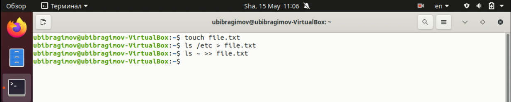
2. Выводим имена всех файлов из file.txt, имеющих расширение .conf, далее запишем их в новый текстовой файл conf.txt.
3. Определим, какие файлы в нашем домашнем каталоге имеют имена, начинающиеся с символа "с". 2 типа.
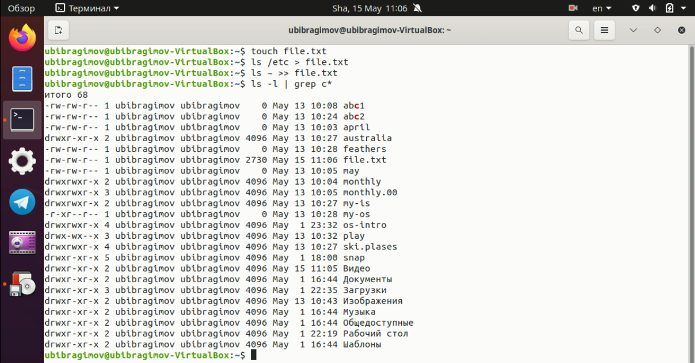
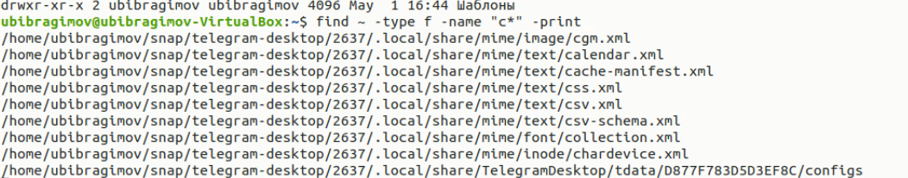
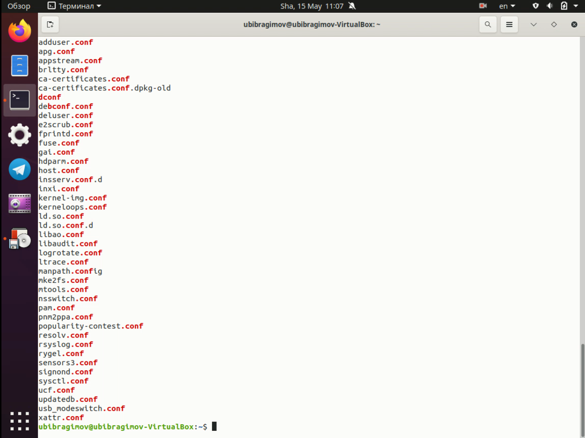
4. Выведем на экран (по-странично) имена файлов из каталога /etc, начинающиеся с символа h.
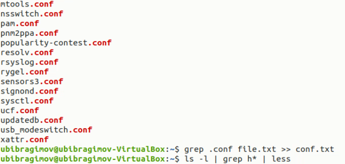
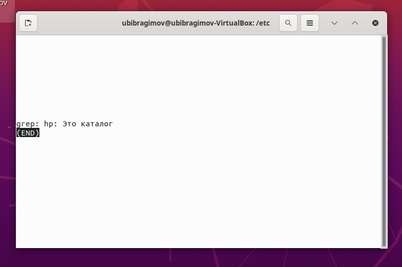
5. Запустим в фоновом режиме процесс, который будет записывать в файл ~/logfile файлы, имена которых начинаются с log и удалим файл ~/logfile.
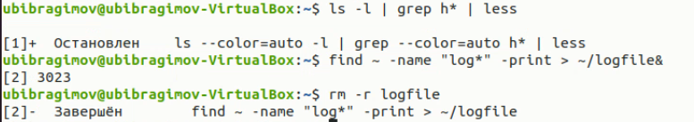
6. Запустим из консоли в фоновом режиме редактор gedit.
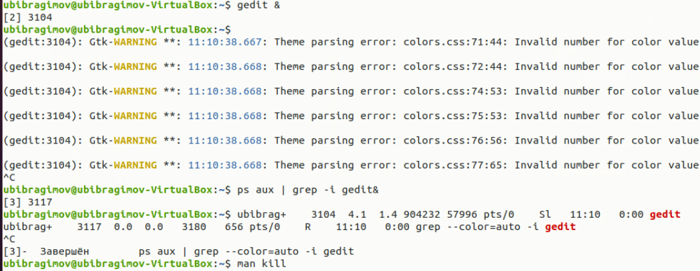
7. Определим идентификатор процесса gedit, используя команду ps, конвейер и фильтр grep. ( PID = 859554)
8. Прочтём справку (man) команды kill, после чего воспользуемся ею для завершения процесса gedit.
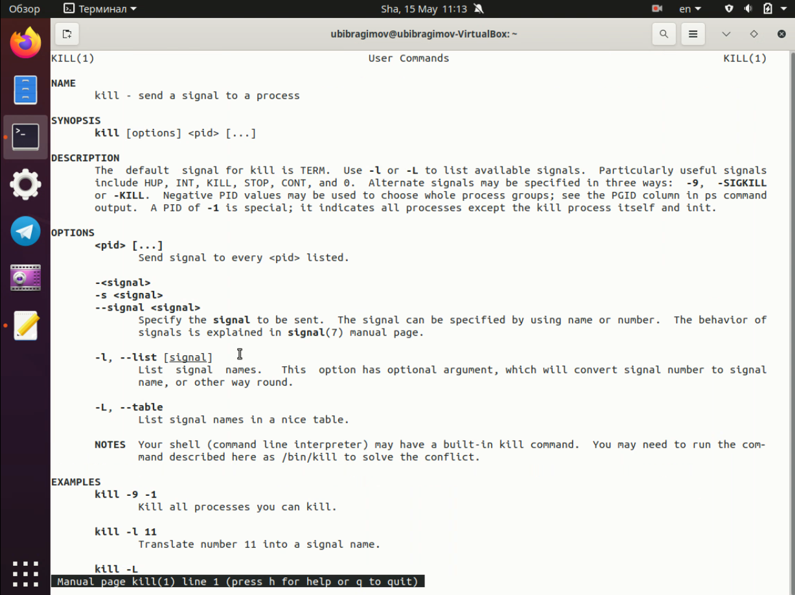
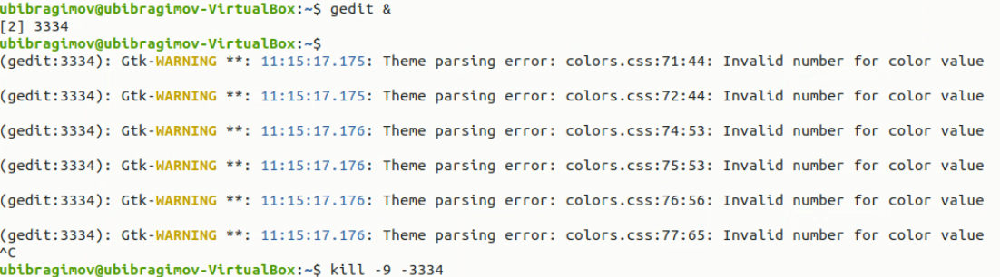0
9. Выполним команды df и du, предварительно получив более подробную информацию об этих командах, с помощью команды man.
+ df
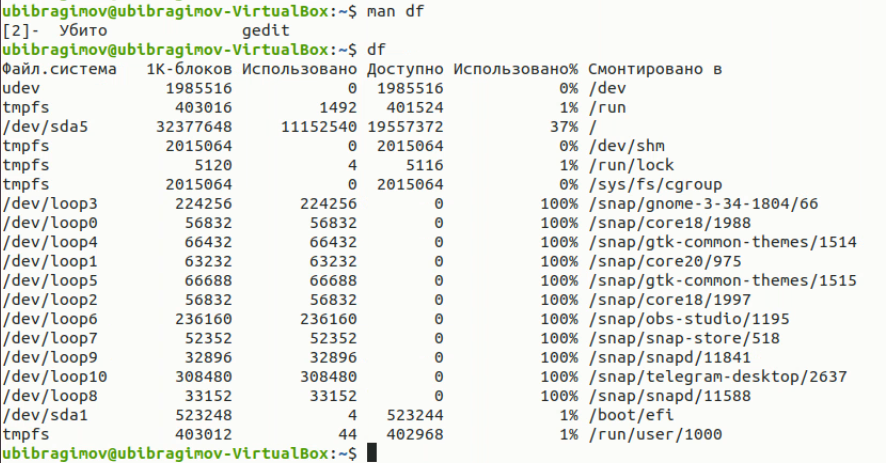1
+ du
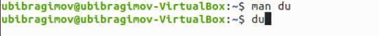2
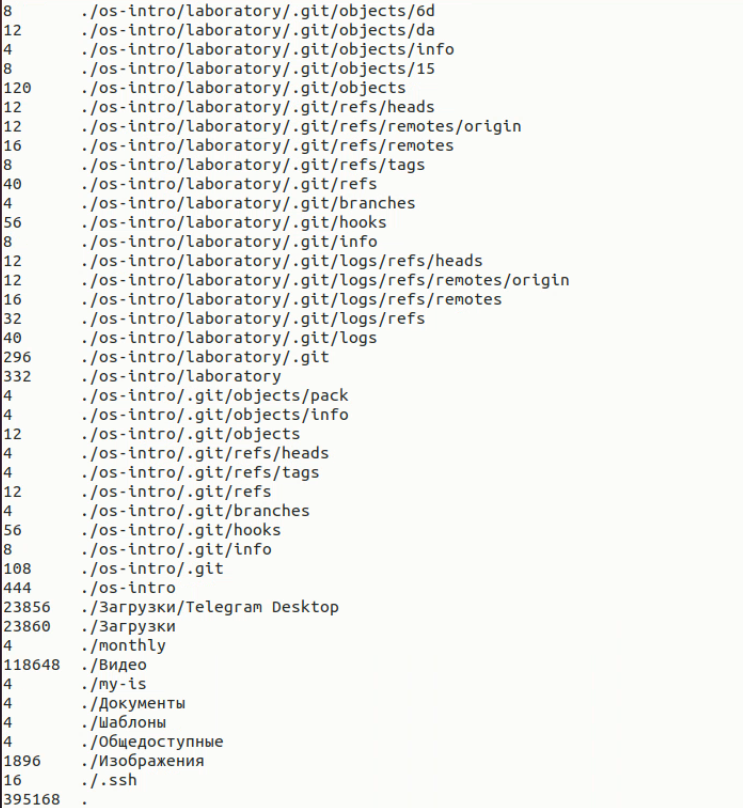3
10. Воспользовавшись справкой команды find, выведем имена всех директорий, имеющихся в нашем домашнем каталоге.
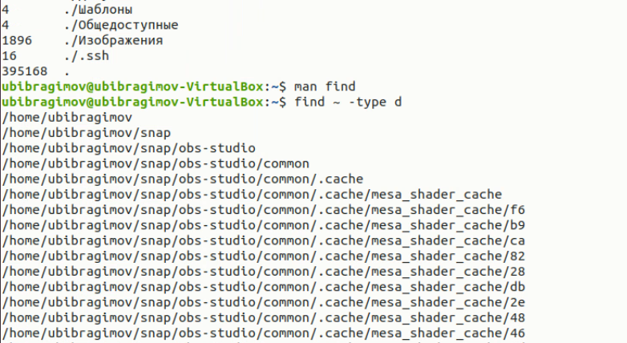4

## Вывод
В ходе выполнения Лабораторной работы №5, были приобретены навыки по использованию инструментами поиска файлов и фильтрацией текстовых данных

## Контрольные вопросы 
1. Существует всего три стандартных потока:
+ `stdin` - стандартный поток ввода (клавиатура - файловый дескриптор 0)
+ `stdout` - стандартный поток вывода (консоль - файловый дескриптор 1)
+ `stderr` - стандартный поток вывода сообщений об ошибках (консоль - файловый дескриптор 2)
2. 
+ `>` - перенаправление stdout в файл. Если файл отсутствовал, то он создаётся, в противном случае - перезаписывается
+ `>>` - перенаправление stdout в файл. Если файл отсутствовал, то он создаётся, иначе - добавляется
3. Конвейер - инструумент для объединения простых команд или утилит в связные цепочки
4. Процесс - связь кода и данных, загруженных в ОЗУ/ПЗУ ЭВМ. К процессу также относится элементы которые взаимодействуют с программой - адресное пространство, глобальные переменные, регистры, стек и тд. Программа - единица выполняемого процесса
5. 
+ PID — Personal ID, идентификатор процесса
+ GID – Group ID, идентификатор группы
6. Программы запущенные в фоне называются задачами - jobs. Ими можно управлять с помощью команды jobs, которая выводит список запущенных в данный момент задач. Для завершения задачи необходимо выполнить команду `kill  %номер задачи`
7. `htop` — монитор процессов, показывает динамический список системных процессов, список обычно выравнивается по использованию ЦПУ
8. `find` - используется для поиска и отображения имён файлов. Формат команды: `find путь [-опции]` - `find /home1/home2/ -%имя% "p*" -print` 
9. `grep` - используется для посика файла по контексту - `grep %string% %name%`
10. `f` - позволяет определить объем свободной памяти на жёстком диске
11. `df /home/%user_name%` - позволяет определить объем домашнего каталога
12. Удалить зависший процесс можно командой `kill %номер задачи%`