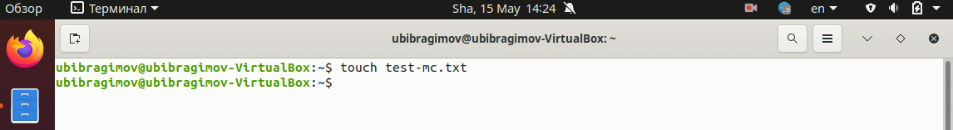

---
# Front matter
lang: ru-Ru
title: "Отчёт по лабораторной работе №8"
author: "Ибрагимов Улугбек Ботырхонович"

# Formatting
toc-title: "Содержание"
toc: true # Table of contents
toc_depth: 2
lof: true # List of figures
lot: true # List of tables
fontsize: 14pt
linestretch: 1.5
papersize: a4paper
documentclass: scrreprt
polyglossia-lang: russian
polyglossia-otherlangs: english
mainfont: PT Serif
romanfont: PT Serif
sansfont: PT Sans
monofont: PT Mono
mainfontoptions: Ligatures=TeX
romanfontoptions: Ligatures=TeX
sansfontoptions: Ligatures=TeX,Scale=MatchLowercase
monofontoptions: Scale=MatchLowercase
indent: true
pdf-engine: lualatex
header-includes:
  - \linepenalty=10 # the penalty added to the badness of each line within a paragraph (no associated penalty node) Increasing the value makes tex try to have fewer lines in the paragraph.
  - \interlinepenalty=0 # value of the penalty (node) added after each line of a paragraph.
  - \hyphenpenalty=50 # the penalty for line breaking at an automatically inserted hyphen
  - \exhyphenpenalty=50 # the penalty for line breaking at an explicit hyphen
  - \binoppenalty=700 # the penalty for breaking a line at a binary operator
  - \relpenalty=500 # the penalty for breaking a line at a relation
  - \clubpenalty=150 # extra penalty for breaking after first line of a paragraph
  - \widowpenalty=150 # extra penalty for breaking before last line of a paragraph
  - \displaywidowpenalty=50 # extra penalty for breaking before last line before a display math
  - \brokenpenalty=100 # extra penalty for page breaking after a hyphenated line
  - \predisplaypenalty=10000 # penalty for breaking before a display
  - \postdisplaypenalty=0 # penalty for breaking after a display
  - \floatingpenalty = 20000 # penalty for splitting an insertion (can only be split footnote in standard LaTeX)
  - \raggedbottom # or \flushbottom
  - \usepackage{float} # keep figures where there are in the text
  - \floatplacement{figure}{H} # keep figures where there are in the text
---

## Цель работы
Освоение основных возможностей командной оболочки Midnight Commander. Приобретение навыков практической работы по просмотру каталогов и файлов и манипуляций с ними

## 1. Задание по Midnight Commander
1.1. Изучил информацию о MC, вызвав в командной строке `man mc`

1.2. Запустил из командной строки MC, изучил его структуру и меню

1.3. Выполнил несколько операций в MC, используя управляющие клавиши
+ Копирование

+ Удаление

+ Перемещение

1.4. Выполнил основные команды меню левой или правой панели:
+ Сортировка файлов

+ Листинг файлов

1.5. Используя возможности подменю Файл, выполнил:
+ Просмотр содержимого текстового файла;

0
+ Редактирование содержимого текстового файла;

+ Создание каталога;

+ Копирование файлов в созданный каталог;

1.6. С помощью соответствующих средств подменю "command"

1.7. Вызвал подменю Настройки

## 2. Задание по текстовому редактору Midnight Commander.
2.1. Создаю текстовый файл test11.txt

2.2. Открываю этот файл с помощью встроенного в mc редактора
2.3. Вставляю текст

2.4. Проделал с текстом следующие манипуляции, используя горячие клавиши:
+ Удалил строку текста

+ Выделил фрагмент текста и скопировал его на новую строку

+ Выделил фрагмент текста и перенес его на новую строку

+ Сохранил файл

+ Отменил последнее действие

+ Перешел в конец файла и написал текст

+ Перешел в начало файла и написал некоторый текст

+ Сохранил и закрыл файл.

2.5. Открыл файл с исходным текстом

2.6. Используя меню редактора, включил подсветку синтаксиса

# Вывод:
В ходе выполнения Лабораторной работы №8, были приобретены навыки по использованию MC

# Контрольные вопросы:
1.
+ Режим "Информация" - на панель выводится информация о подсвеченном в другой панели файле и о текущей файловой системе
+ Режим "Дерево" - в одной из панелей выводится графическое изображение структуры дерева каталогов
2. 
+ F1- Вызывает контекстно-зависимую подсказку
+ F2 - Вызывает меню, создаваемое пользователем. Оно позволяет создавать и добавлять дополнительные функции
+ F3 - Просмотр файла, на который указывает подсветка в активной панели
+ F4 - Вызов встроенного редактора для файла, на который указывает подсветка в активной панели
+ F5- Копирование файла или группы отмеченных файлов из каталога, отображаемого в активной панели, в каталог, отображаемый на второй панели. При копировании одного файла можно поменять его имя
+ F6 - Перенос файла или группы отмеченных файлов из каталога, отображаемого в активной панели, в каталог, отображаемый на второй панели. Как и при копировании, можно поменять имя файла или целого каталога
+ F7 - Создание подкаталога в каталоге, отображаемом в активной панели
+ F8- Удаление файла (подкаталога) или группы отмеченных файлов
+ F9 - Вызов основного меню программы (отображаемого над панелями)
+ F10 - Выход из программы
3. Структура меню левой (или правой) панели MC:
+ список файлов (этот режим используется для просмотра списка файлов).
+ быстрый просмотр (в этом режиме панель переключается в режим вьюера, который показывает содержимое текущего файла; если выбрать эту панель (нажав клавишу Tab или при помощи мыши), то здесь можно пользоваться стандартными командами вьюера)
+ информация (в этом режиме отображается информация, связанная с текущим файлом и, по возможности, информация о текущей файловой системе)
+ дерево (этот режим идентичен функции отображения дерева каталогов)
+ порядок сортировки (существует восемь типов сортировки файлов: по имени, по расширению, по времени последней модификации файла, по времени последнего доступа к файлу, по времени модификации индексного дескриптора, по размеру, по значению индексного деакриптора и без порядка. В диалоговом окне Sort order можно выбрать тип сортировки, а также указать, что сортировку следует производить в обратном порядке)
+ фильтр (эта команда позволяет указать шаблон для файлов, которые должны отображаться; вне зависимости от шаблона, каталоги и ссылки к каталогам отображаются всегда)
4. Подпункты меню «Файл»:
+ F3 - позволяет посмотреть содержимое текущего файла без возможности редактирования
+ F4 - открывает текущий файл для его редактирования
+ F5 - осуществляет копирование одного или нескольких файлов или каталогов в указанное место
+ Ctrl-x c - позволяет изменить права доступа к одному или нескольким файлам или каталогам
+ Ctrl-x l - позволяет создать жёсткую ссылку к текущему файлу
+ Ctrl-x s - позволяет создать символическую ссылку к текущему файлу
+ Ctrl-x o - позволяет задать владельца и имя группы для одного или нескольких файлов или каталогов
+ F6 - позволяет переименовать один или несколько файлов или каталогов
+ F7 - позволяет создать каталог
+ F8 - позволяет удалить один или несколько файлов или каталогов
+ F10 - завершает работу
5. Подпункты меню "Команда":
+ дерево каталогов - отображает структуру каталогов системы
+ поиск файла - выполняет поиск файлов по заданным параметрам
+ переставить панели - меняет местами левую и правую панели
+ сравнить каталоги - сравнивает содержимое двух каталогов
+ размеры каталогов - отображает размер и время изменения каталога
+ история командной строки - выводит на экран список ранее выполненных в оболочке команд
+ каталоги быстрого доступа - при вызове выполняется быстрая смена текущего каталога на один из заданного списка
+ восстановление файлов - позволяет восстановить файлы на файловых системах ext2 и ext3
+ редактировать файл расширений - позволяет задать с помощью определённого синтаксиса действия при запуске файлов с определённым расширением
+ редактировать файл меню — позволяет отредактировать контекстное меню пользователя, вызываемое по клавише F2
+ редактировать файл расцветки имён — позволяет подобрать оптимальную для пользователя расцветку имён файлов в зависимости от их типа.
6. Подпункты меню «настройки»:
+ Конфигурация позволяет скорректировать настройки работы с панелями
+ Внешний вид и Настройки панелей определяет элементы, отображаемые при вызове MC, а также цветовое выделение
+ Биты символов задаёт формат обработки информации локальным терминалом
+ Подтверждение позволяет установить или убрать вывод окна с запросом подтверждения действий при определенных операциях
+ Распознание клавиш диалоговое окно используется для тестирования клавиш
+ Виртуальные ФС настройки виртуальной файловой системы

7. Встроенные команды MC:
+ F1 - Вызов контекстно-зависимой подсказки
+ F2 - Вызов пользовательского меню с возможностью создания and/or
+ F3 - Просмотр содержимого файла, на который указывает подсветка в активной панели
+ F4 - Вызов встроенного в MC редактора для изменения содержания файла, на который указывает подсветка в активной панели
+ F5 - Копирование одного или нескольких файлов, отмеченных в первой (активной) панели, в каталог, отображаемый на второй панели
+ F6 - Перенос одного или нескольких файлов, отмеченных в первой панели, в каталог, отображаемый на второй панели
+ F7 - Создание подкаталога в каталоге, отображаемом в активной панели
+ F8 - Удаление одного или нескольких файлов, отмеченных в первой панели файлов
+ F9 - Вызов меню MC
+ F10 - Выход из MC
8. Команды MC :
+ Ctrl + Y - удалить строку
+ Ctrl + U - отмена последней операции
+ Ins - вставка/замена
+ F7 - поиск
+ Shift + F7 - повтор последней операции поиска
+ F4 - замена файла
+ F3 - первое нажатие начало выделения, второе это окончание выделения
+ F5 - копировать выделенный фрагмент F6 переместить выделенный фрагмент
+ F8 - удалить выделенный фрагмент
+ F2 - записать изменения в файл
+ F10 - выйти из редактора
9.  Характеристика средств mc, которые позволяют создавать меню, определяемых пользователем. Перейти в строку меню панелей MC можно с помощью клавиши F9. В строке меню имеются пять меню: Левая панель, Файл, Команда, Настройки и Правая панель. В меню каждой левой и правой панели можно выбрать "Формат списка":
+ стандартный - выводит список файлов и каталогов с указанием размера и времени правки
+ ускоренный - позволяет задать число столбцов, на которые разбивается панель при выводе списка имён файлов или каталогов без дополнительной информации
+ расширенный - помимо названия файла или каталога выводит сведения о правах доступа, владельце, группе, размере, времени правки
+ определённые пользователем - позволяет вывести те сведения о файле или каталоге, которые задаст пользователь
10. Средства MC, которые позволяют выполнять действия, над файлом - все команды, содержащиеся в меню в левой или правой панели, файле, команде, и в настройках
