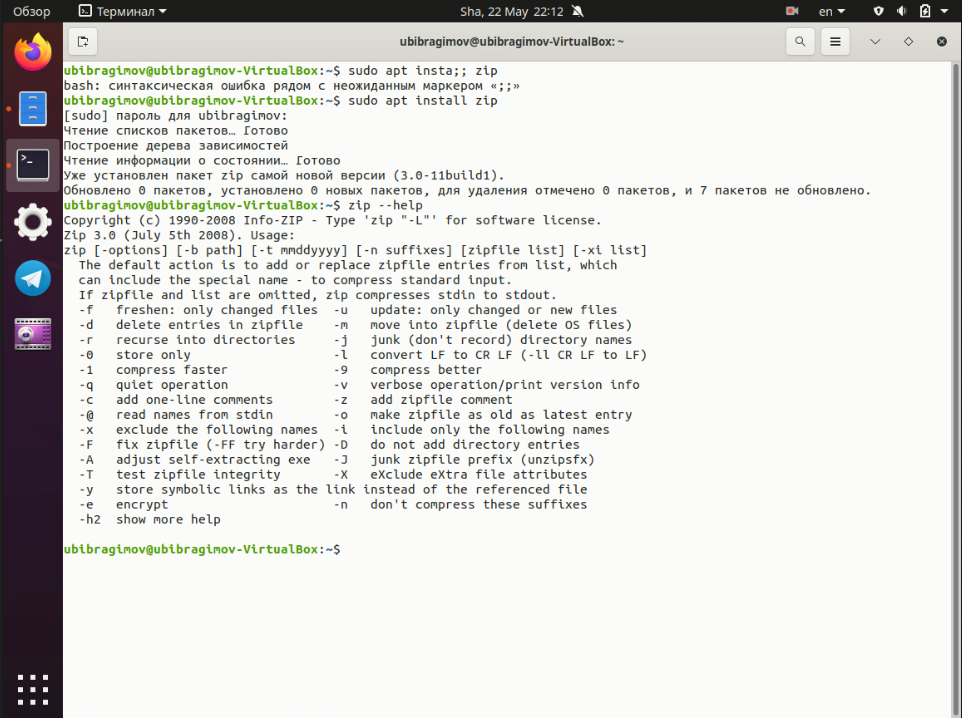
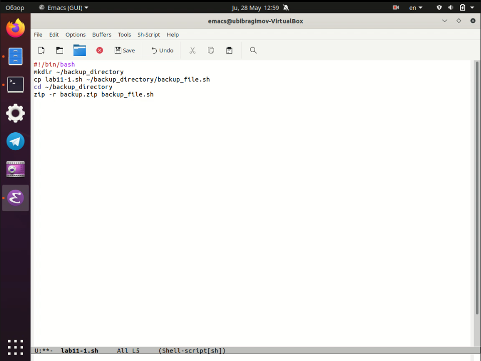
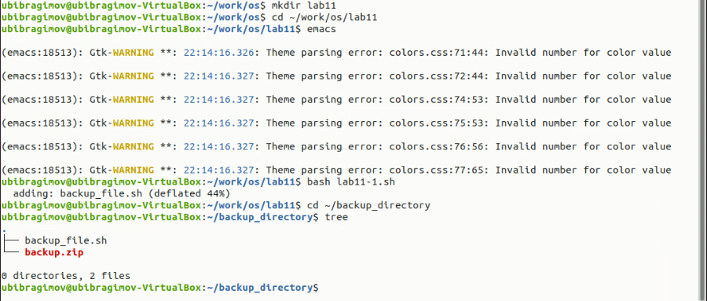
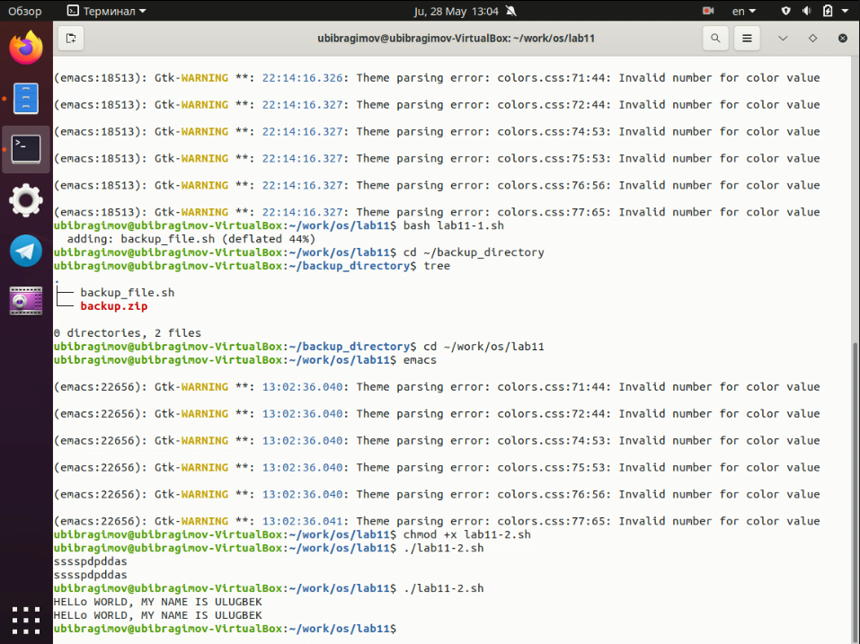
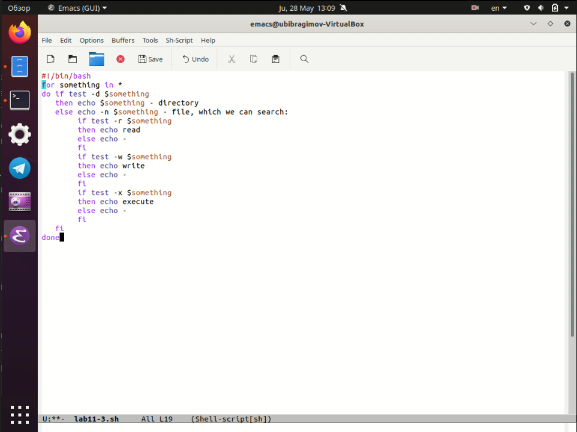
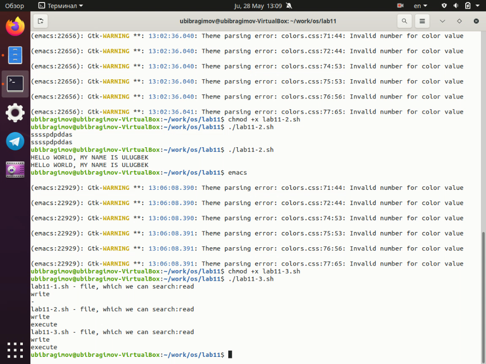
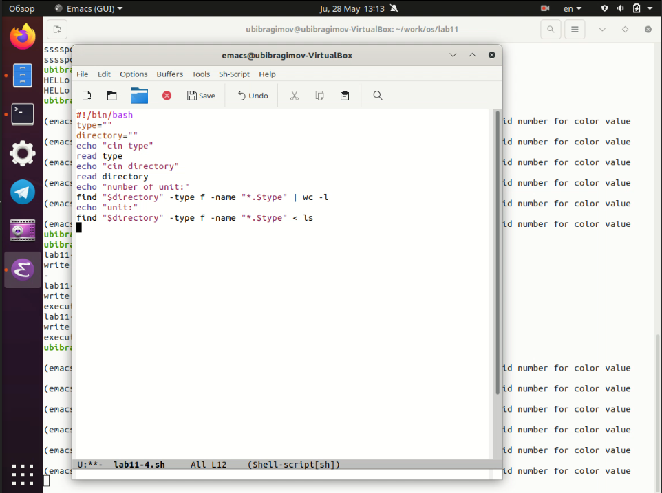
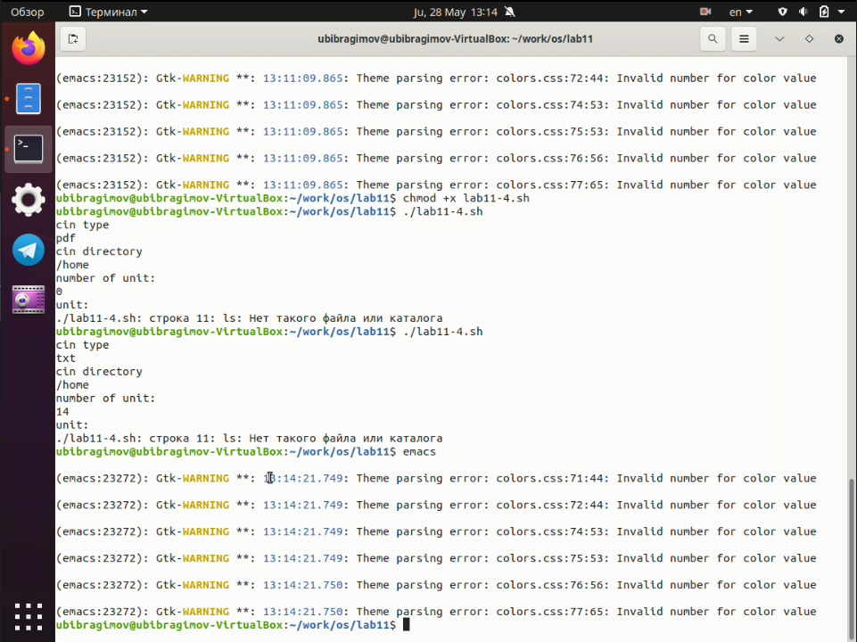

---
# Front matter
lang: ru-Ru
title: "Отчёта по лабораторной работе №11"
author: "Ибрагимов Улугбек Ботырхонович"

# Formatting
toc-title: "Содержание"
toc: true # Table of contents
toc_depth: 2
lof: true # List of figures
lot: true # List of tables
fontsize: 14pt
linestretch: 1.5
papersize: a4paper
documentclass: scrreprt
polyglossia-lang: russian
polyglossia-otherlangs: english
mainfont: PT Serif
romanfont: PT Serif
sansfont: PT Sans
monofont: PT Mono
mainfontoptions: Ligatures=TeX
romanfontoptions: Ligatures=TeX
sansfontoptions: Ligatures=TeX,Scale=MatchLowercase
monofontoptions: Scale=MatchLowercase
indent: true
pdf-engine: lualatex
header-includes:
  - \linepenalty=10 # the penalty added to the badness of each line within a paragraph (no associated penalty node) Increasing the value makes tex try to have fewer lines in the paragraph.
  - \interlinepenalty=0 # value of the penalty (node) added after each line of a paragraph.
  - \hyphenpenalty=50 # the penalty for line breaking at an automatically inserted hyphen
  - \exhyphenpenalty=50 # the penalty for line breaking at an explicit hyphen
  - \binoppenalty=700 # the penalty for breaking a line at a binary operator
  - \relpenalty=500 # the penalty for breaking a line at a relation
  - \clubpenalty=150 # extra penalty for breaking after first line of a paragraph
  - \widowpenalty=150 # extra penalty for breaking before last line of a paragraph
  - \displaywidowpenalty=50 # extra penalty for breaking before last line before a display math
  - \brokenpenalty=100 # extra penalty for page breaking after a hyphenated line
  - \predisplaypenalty=10000 # penalty for breaking before a display
  - \postdisplaypenalty=0 # penalty for breaking after a display
  - \floatingpenalty = 20000 # penalty for splitting an insertion (can only be split footnote in standard LaTeX)
  - \raggedbottom # or \flushbottom
  - \usepackage{float} # keep figures where there are in the text
  - \floatplacement{figure}{H} # keep figures where there are in the text
---

## Титульный лист
Отчёт по лабораторной работе №11
Ибрагимов Улугбек Ботырхонович

## Цель работы
Изучить основы программирования в оболочке ОС UNIX/Linux, научиться писать небольшие командные файлы

## Ход выполнения работы:
1. Написать скрипт, который при запуске будет делать резервную копию самого себя (то есть файла, в котором содержится его исходный код) в другую директорию `backup` в вашем домашнем каталоге. При этом файл должен архивироваться одним из архиваторов на выбор - `zip`, `bzip2` или `tar`. Способ использования командархивации необходимо узнать, изучив справку.

2. Написать пример командного файла, обрабатывающего любое произвольноечисло аргументов командной строки, в том числе превышающее десять. Например, скрипт может последовательно распечатывать значения всех переданных аргументов

3. Написать командный файл — аналог команды `ls` (без использования самой этойкоманды и команды `dir`). Требуется, чтобы он выдавал информацию о нужном каталоге и выводил информацию о возможностях доступа к файлам этого каталога

4. Написать командный файл, который получает в качестве аргумента командной строки формат файла `.txt,.doc,.jpg,.pdfи т.д.` и вычисляет количество таких файлов в указанной директории. Путь к директории также передаётся ввиде аргумента командной строки

## Вывод
В ходе выполнения Лабораторной работы №11, были приобретены навыки по языку `bash`, а также изучил возможности которые дает этот язык в повседневном использовании

## Контрольные вопросы
1. Командная строка - промежуточный слой связи между пользователем и операционной системой, пользователь дает команды операционной системе через командную строку, а операционная система в свою очередь дает ответ пользователю через командную строку. Пример: POSIX, bash, zsh, cmd
2. POSIX - стандартизированный интерфейс оболочки между пользователем и операционной системой. В теории, абсолютно все дистрибутивы выполненные на основе *nix, обладают возможностью кроссплатформенного исполнения инструкций, например инструкция для Ubuntu, MacOS, Solaris должна выглядеть одинаково при использовании гайдлайнов POSIX, отдельно все встраиваемые операционные системы обладают стандартом `POSIX Ready`, что означает почти 99% (кроме специальных инструкций, например из-за различных архитектур ОС) поддерживаемость и на других дистрибутивах с такой пометкой
3. В `bash` могут быть определены одномерные массивы - переменные специального вида, доступ к которым осуществляется с одним именем, но с разным индексом. Для управления используются команды: `name[%n%] = value`
4. Оператор `let` - используется для суммирования 
   Оператор `read` - считывает строку из стандартного ввода и разбивает на слова
5. Арифметические операции в `bash`:
+ `+` - сложение 
+ `-` - вычитание
+ `*` - умножение 
+ `/` - деление
+ `%` - вычисление остатка
+ `**` - возведение в степень
+ `+=` - декремент
+ `-=` - инкремент
+ `*=` - умножение на заданное число
+ `/=` - деление на заданное число
6. `(( ))` - запись условия `if-else` в оболочке `bash`
7. Стандартные переменные:
+ `HOME` - домашний каталог пользователя
+ `CDPATH` - список каталогов разделенных двоеточиями и используемые при поиске пути встроенной командой `cd`
+ `IFS` - символы, с помощью которых разделяются поля
+ `MAIL` - если не задан `MAILPATH`, то пользователь будет информирован  
+ `MAILPATH` - список имен файлов, которые ОС периодически проверяет на наличие письма
+ `PATH` - список каталогов, в которых командная оболочка ищет команды
8. `' < > * ? | \ " &` - метасимволы, которые значительно упрощают использование командной оболочки путем написания регулярных выражений
9. Экранирование осуществляется с помощью обратного слеша `\`, для выражений используются двойные кавычки, а для экранирования группы метасимволов испольщуют одинарные кавычки
10. Создаем текстовый файл с необходмой кодировкой, открываем терминал, переходим в директорию с файлов, и исполняем команду: `bash my_command [arguments]`, вводим необходимые аргументы после названия нашего файла и нажимаем Enter, так же можно изменить доступ и дать права `sudo chmod u+x my_command` и после изменения доступа можно вызывать коммандный файл без использования слова `bash`
11. Для создания функций используется ключевое слово `function`, после которого можно написать команды которые при исполнении файла будут исполнены в одном блоке `function`
12. Заходим в терминал, пишем `ls -lrt`, смотрим вывод, если в выводе есть символ `d`, то значит что искомый нами файл является директорийй (каталогом или папкой)
13. Команда `set` - выводит список переменных окружений
    Команда `typeset` - ограничивает переменные (изменяет доступ, числа, массив или вообще осущесвляет экспорт данных)
    Команда `unset` - удаляет переменную, а на самом деле устанавливает ее значение `null`
14. В командный файл можно передать от одного до девяти файлов
15. 
+ `$*` — отображается вся командная строка или параметры оболочки
+ `$?` — код завершения последней выполненной команды
+ `$$` — уникальный идентификатор процесса, в рамках которого выполняется командный процессор
+ `$!` — номер процесса, в рамках которого выполняется последняя вызванная на выполнение в командном режиме команда
+ `$-` — значение флагов командного процессора
+ `${#*}` — возвращает целое число — количество слов, которые были результатом `$`
+ `${#name}` — возвращает целое значение длины строки в переменной name
+ `${name[n]}` — обращение к `n-му` элементу массива
+ `${name[*]}` — перечисляет все элементы массива, разделённые пробелом
+ `${name[@]}` — то же самое, но позволяет учитывать символы пробелы в самих переменных
+ `${name:-value}` — если значение переменной name не определено, то оно будет заменено на указанное `value`
+ `${name:value}` — проверяется факт существования переменной
+ `${name=value}` — если name не определено, то ему присваивается значение `value`
+ `${name?value}` — останавливает выполнение, если имя переменной не определено, и выводит value как сообщение об ошибке
+ `${name+value}` — это выражение работает противоположно `${name-value}`. Если переменная определена, то подставляется `value`
+ `${name#pattern}` — представляет значение переменной name с удалённым самым коротким левым образцом `(pattern)`
+ `${#name[*]}` и `${#name[@]}` — эти выражения возвращают количество элементов в массиве name