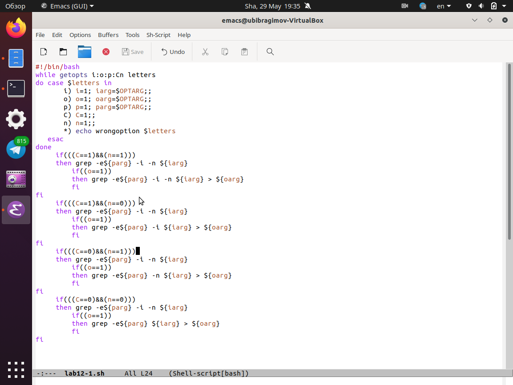
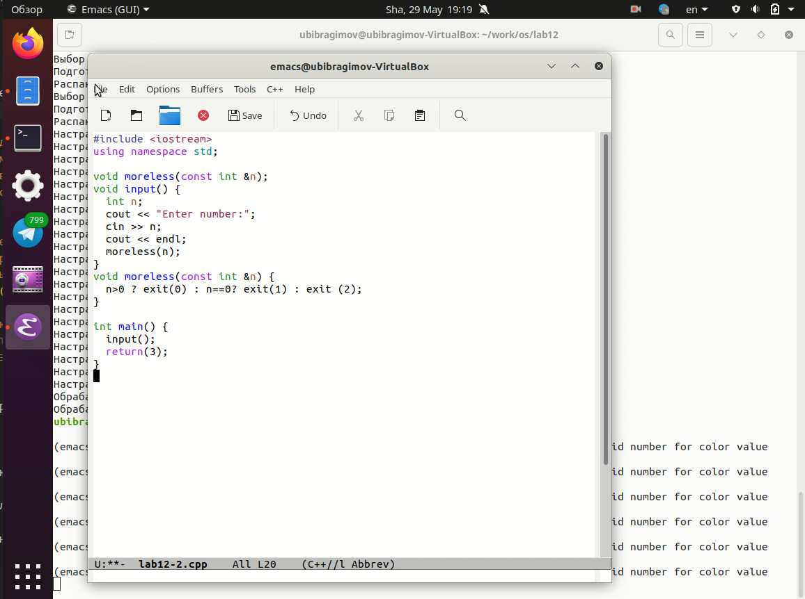
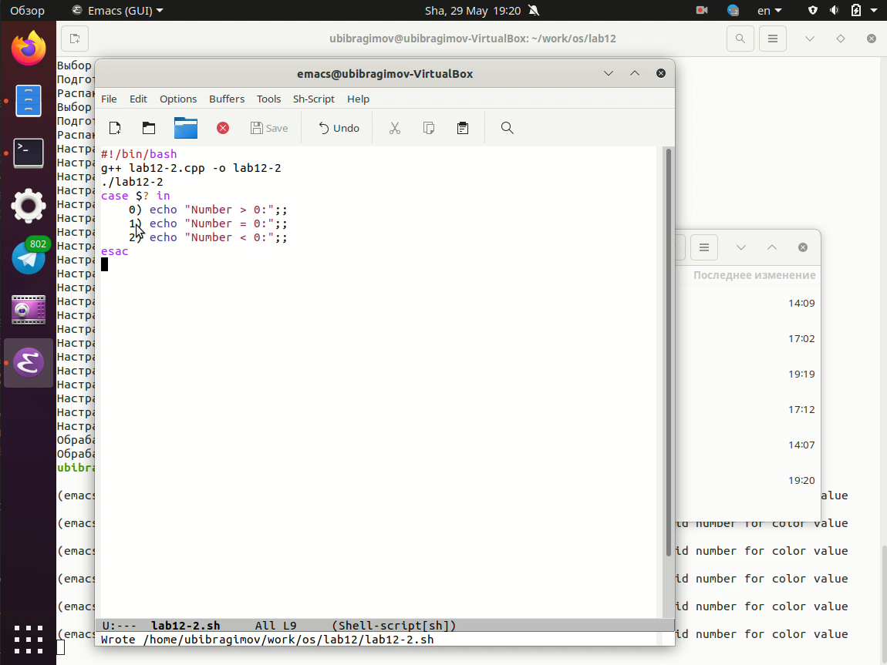
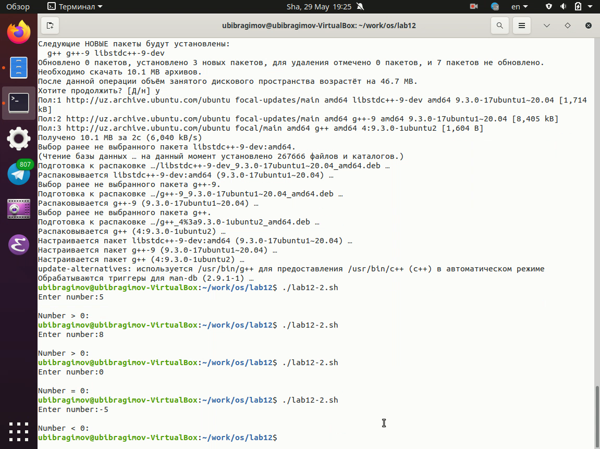
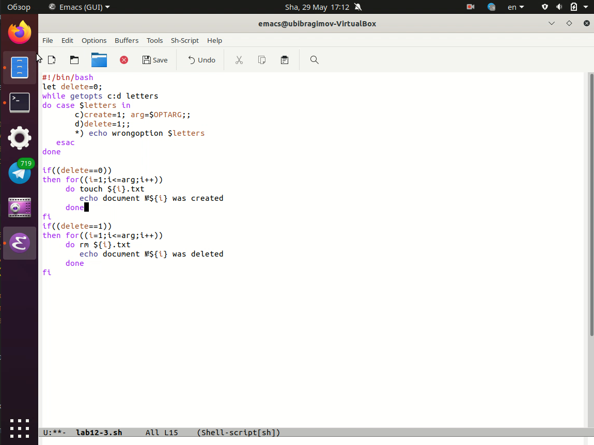
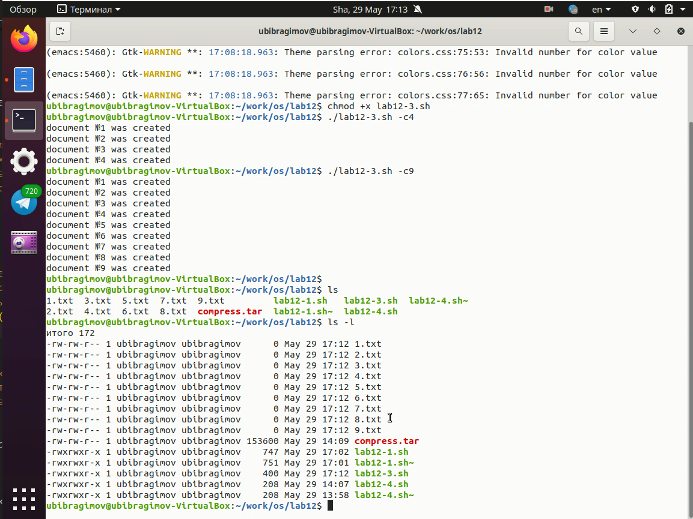
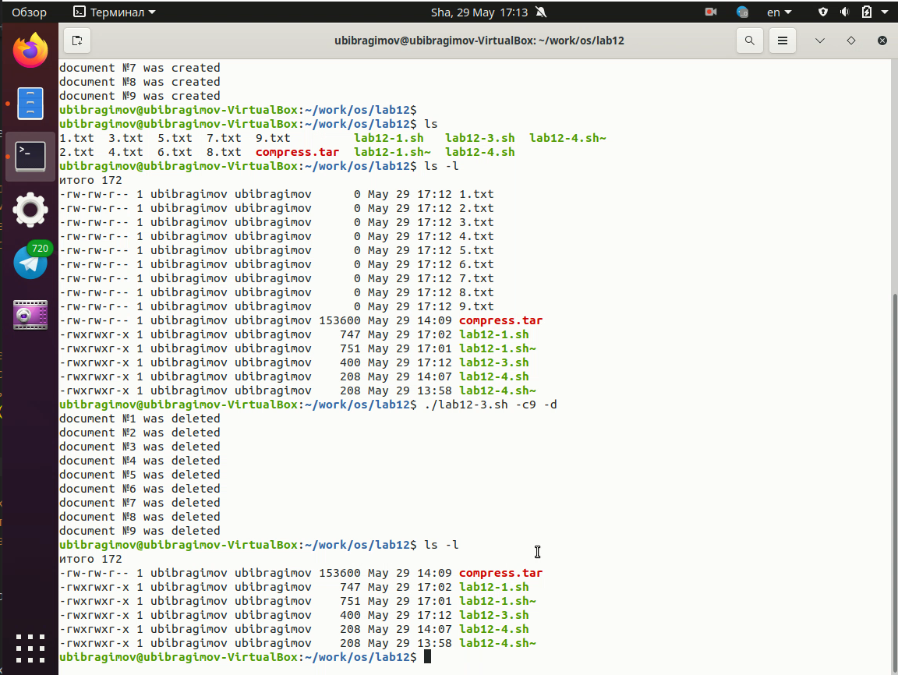
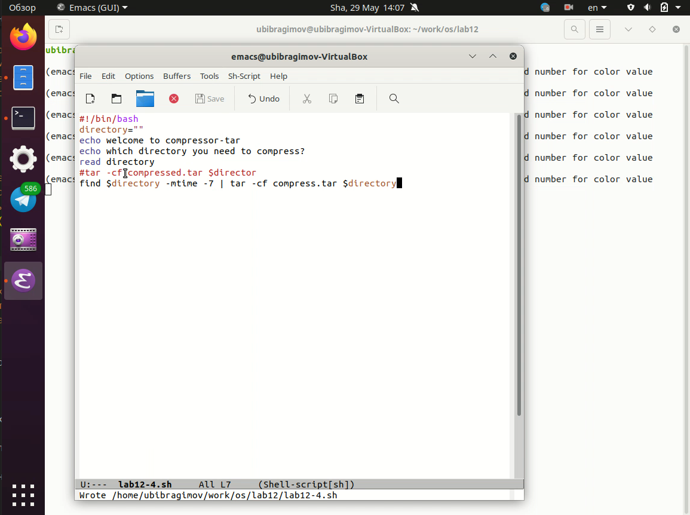
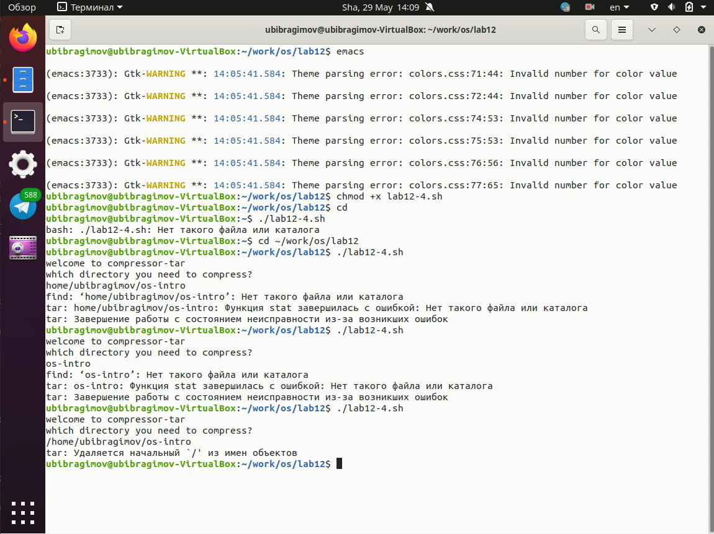
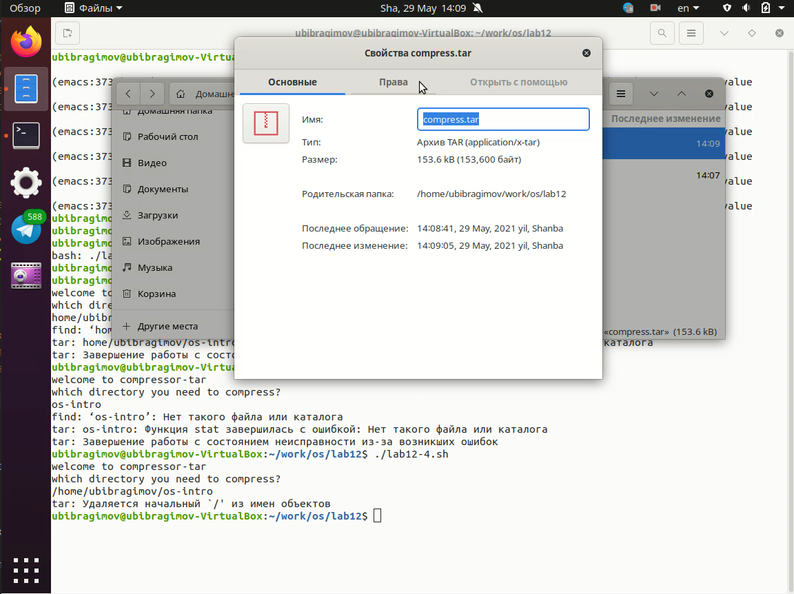

---
# Front matter
lang: ru-Ru
title: "Отчёта по лабораторной работе №12"
author: "Ибрагимов Улугбек Ботырхонович"

# Formatting
toc-title: "Содержание"
toc: true # Table of contents
toc_depth: 2
lof: true # List of figures
lot: true # List of tables
fontsize: 14pt
linestretch: 1.5
papersize: a4paper
documentclass: scrreprt
polyglossia-lang: russian
polyglossia-otherlangs: english
mainfont: PT Serif
romanfont: PT Serif
sansfont: PT Sans
monofont: PT Mono
mainfontoptions: Ligatures=TeX
romanfontoptions: Ligatures=TeX
sansfontoptions: Ligatures=TeX,Scale=MatchLowercase
monofontoptions: Scale=MatchLowercase
indent: true
pdf-engine: lualatex
header-includes:
  - \linepenalty=10 # the penalty added to the badness of each line within a paragraph (no associated penalty node) Increasing the value makes tex try to have fewer lines in the paragraph.
  - \interlinepenalty=0 # value of the penalty (node) added after each line of a paragraph.
  - \hyphenpenalty=50 # the penalty for line breaking at an automatically inserted hyphen
  - \exhyphenpenalty=50 # the penalty for line breaking at an explicit hyphen
  - \binoppenalty=700 # the penalty for breaking a line at a binary operator
  - \relpenalty=500 # the penalty for breaking a line at a relation
  - \clubpenalty=150 # extra penalty for breaking after first line of a paragraph
  - \widowpenalty=150 # extra penalty for breaking before last line of a paragraph
  - \displaywidowpenalty=50 # extra penalty for breaking before last line before a display math
  - \brokenpenalty=100 # extra penalty for page breaking after a hyphenated line
  - \predisplaypenalty=10000 # penalty for breaking before a display
  - \postdisplaypenalty=0 # penalty for breaking after a display
  - \floatingpenalty = 20000 # penalty for splitting an insertion (can only be split footnote in standard LaTeX)
  - \raggedbottom # or \flushbottom
  - \usepackage{float} # keep figures where there are in the text
  - \floatplacement{figure}{H} # keep figures where there are in the text
---

## Титульный лист
Отчёт по лабораторной работе №12
Ибрагимов Улугбек Ботырхонович

## Цель работы
Изучить основы программирования в оболочке ОС UNIX, научиться писать более сложные командные файлы с использованием логических управляющих конструкций и циклов.

## Видео 

* Часть первая  

* Часть вторая  

* Часть третья  

* Часть четвертая  

## Ход работы.

## 1. Используя команды getopts grep, написать командный файл, который анализирует командную строку с ключами:
+ `-i` — прочитать данные из указанного файла
+ `-o` — вывести данные в указанный файл
+ `-p` - шаблон — указать шаблон для поиска
+ `-C` — различать большие и малые буквы
+ `-n` — выдавать номера строк
а затем ищет в указанном файле нужные строки, определяемые ключом `-p`

## 2. Написать на языке Си программу, которая вводит число и определяет, является ли оно больше нуля, меньше нуля или равно нулю. Затем программа завершается с помощью функции `exit(n)`, передавая информацию в коде завершения в оболочку. Командный файл должен вызывать эту программу и, проанализировав с помощью команды `$?`, выдать сообщение о том, какое число было введено

## 3. Написать командный файл, создающий указанное число файлов, пронумерованных последовательно от 1 до N (например - 1.tmp, 2.tmp, 3.tmp, 4.tmp и т.д.). Число файлов, которые необходимо создать, передаётся в аргументы командной строки. Этот же командный файл должен уметь удалять все созданные им файлы (если они существуют)

## 4. Написать командный файл, который с помощью команды `tar` запаковывает в архив все файлы в указанной директории. Модифицировать его так, чтобы запаковывались только те файлы, которые были изменены менее недели тому назад (использовать команду `find`)

## Вывод
В ходе выполнения Лабораторной работы №12, были приобретены навыки по написанию сложных скриптов и их адмнистрированию

## Контрольные вопросы
1. `getpods` - эта утилита анализирует аргументы команд из исполняемого файла
2. Следующие метасимволы используют для генерации имен файлов:
+ `*` - любая или пустая последовательность символов
+ `?` - один любой символ
+ `[...]` - любой из символов указанных в квадратных скобках с перечислением или указанием диапазона
+ `cat N*` - выдает все файлы начинающиеся с `N`
+ `cat *N*` - выдает все файлы содержащие `N`
+ `cat` - выдаст все файлы с однобуквенным расширением `hello.o`, `hello.c`, но не `hello.cpp`
+ `program.?` - выдаст `program.com`
+ `cat [a-d]*` - выдаст файлы которые начинаются с буквы `a` и заканчиваются `d`
3. Операторы управления действиями - > (вывод информации), < (ввод информации), & (управляет потоком исполнения команд), && (запускает исполнения команды или команд в фоне), | (передает данные между программами), || (проверяет код завершения предыдущей команды)
4. Команда `break` служит для прерывания цикла и передает управление программой команде, которая идет следующей за циклом
5. 
+ `false` - логическое нет, отрицание, то есть дальнейшую остановку программы или переход в другую ветвь ветвления программы в зависимости от условий
+ `true` - логическое да, согласие на дальнейшее исполнение программы согласно заданным условия
6. Строка `if test -f man$s/$i.$s` означает условие для проверки существования файла `man`
7. `while` - выполняет цикл пока указанное в нем условие истинно (1, true), а `until` - выполняет цикл пока указанное в нем условие ложно (0, false)
