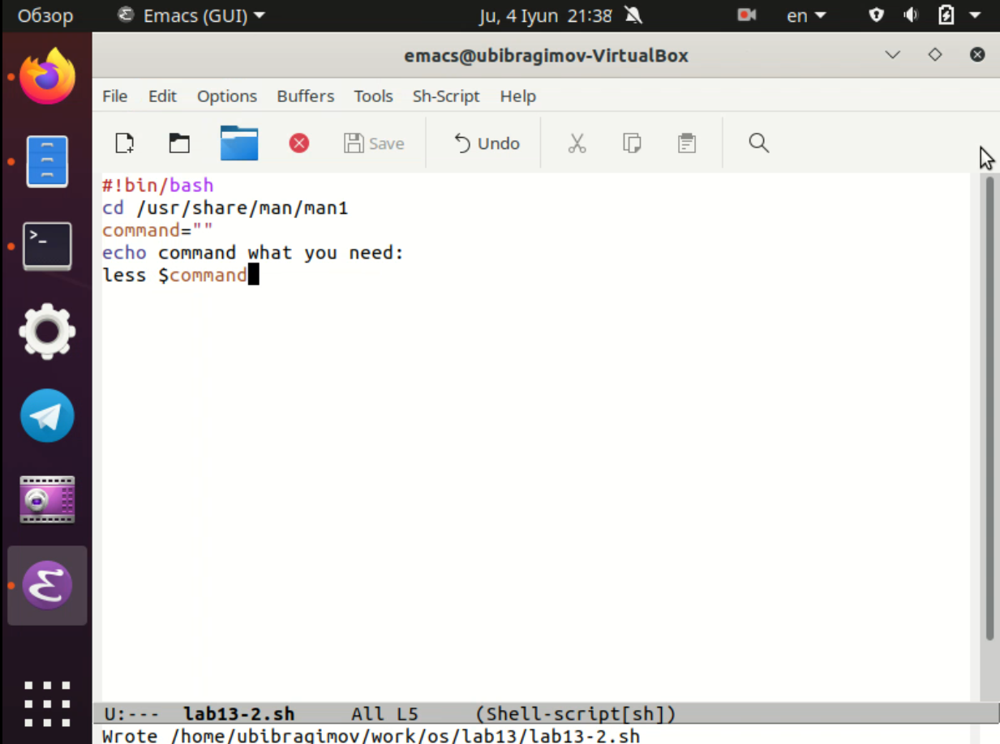
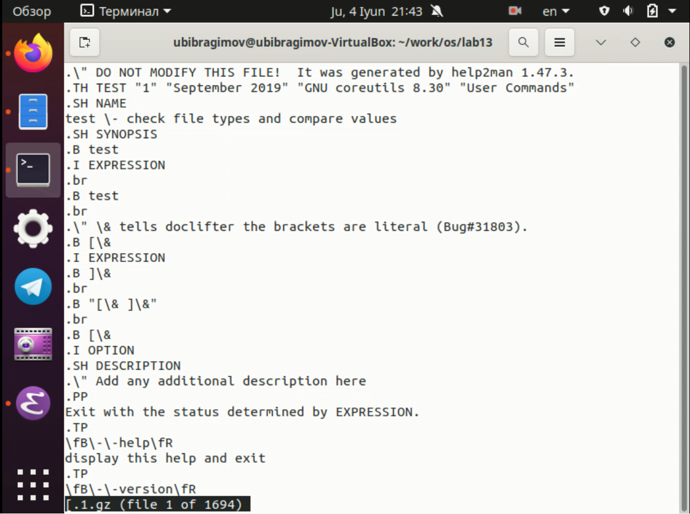
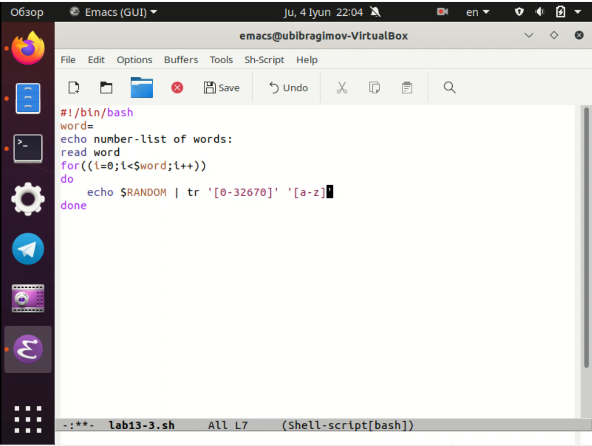
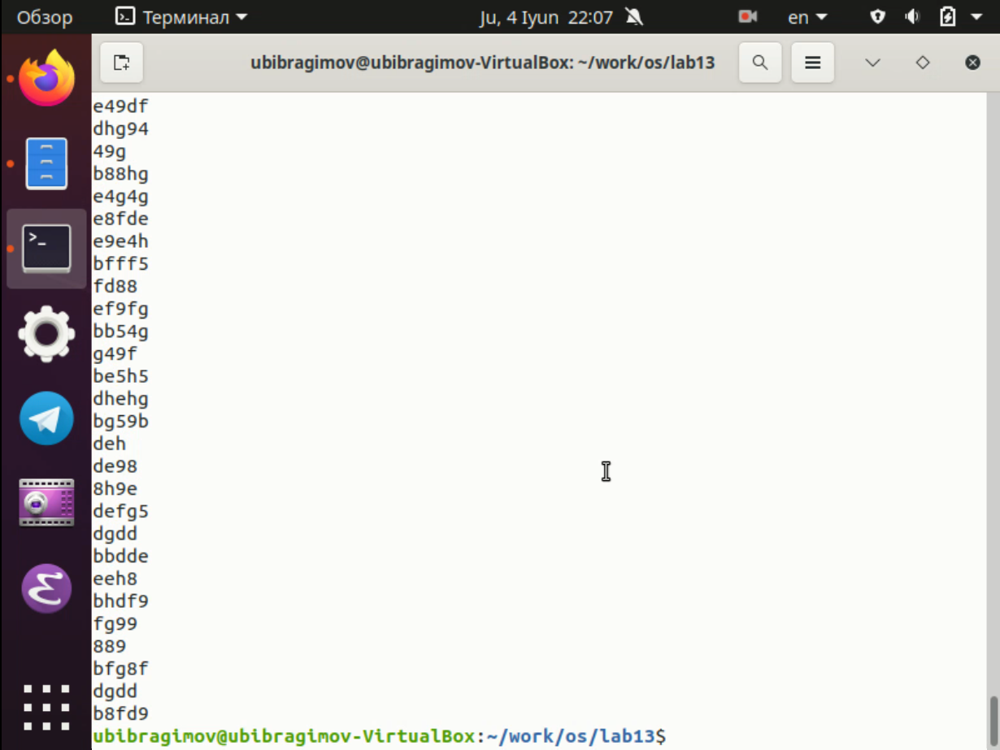

---
# Front matter
lang: ru-Ru
title: "Отчёта по лабораторной работе №13"
author: "Ибрагимов Улугбек Ботырхонович"

# Formatting
toc-title: "Содержание"
toc: true # Table of contents
toc_depth: 2
lof: true # List of figures
lot: true # List of tables
fontsize: 14pt
linestretch: 1.5
papersize: a4paper
documentclass: scrreprt
polyglossia-lang: russian
polyglossia-otherlangs: english
mainfont: PT Serif
romanfont: PT Serif
sansfont: PT Sans
monofont: PT Mono
mainfontoptions: Ligatures=TeX
romanfontoptions: Ligatures=TeX
sansfontoptions: Ligatures=TeX,Scale=MatchLowercase
monofontoptions: Scale=MatchLowercase
indent: true
pdf-engine: lualatex
header-includes:
  - \linepenalty=10 # the penalty added to the badness of each line within a paragraph (no associated penalty node) Increasing the value makes tex try to have fewer lines in the paragraph.
  - \interlinepenalty=0 # value of the penalty (node) added after each line of a paragraph.
  - \hyphenpenalty=50 # the penalty for line breaking at an automatically inserted hyphen
  - \exhyphenpenalty=50 # the penalty for line breaking at an explicit hyphen
  - \binoppenalty=700 # the penalty for breaking a line at a binary operator
  - \relpenalty=500 # the penalty for breaking a line at a relation
  - \clubpenalty=150 # extra penalty for breaking after first line of a paragraph
  - \widowpenalty=150 # extra penalty for breaking before last line of a paragraph
  - \displaywidowpenalty=50 # extra penalty for breaking before last line before a display math
  - \brokenpenalty=100 # extra penalty for page breaking after a hyphenated line
  - \predisplaypenalty=10000 # penalty for breaking before a display
  - \postdisplaypenalty=0 # penalty for breaking after a display
  - \floatingpenalty = 20000 # penalty for splitting an insertion (can only be split footnote in standard LaTeX)
  - \raggedbottom # or \flushbottom
  - \usepackage{float} # keep figures where there are in the text
  - \floatplacement{figure}{H} # keep figures where there are in the text
---

## Титульный лист
Отчёт по лабораторной работе №13
Ибрагимов Улугбек Ботырхонович

## Цель работы
Изучить основы программирования в оболочке ОС UNIX, научиться писать более сложные командные файлы с использованием логических управляющих конструкций и циклов.

## Ход работы.
## 1. Написать командный файл, реализующий упрощённый механизм семафоров. Командный файл должен в течение некоторого времени `t1` дожидаться освобождения ресурса, выдавая об этом сообщение, а дождавшись его освобождения, использовать его в течение некоторого времени `t2<>t1`, также выдавая информацию о том, что ресурс используется соответствующим командным файлом (процессом). Запустить командный файл в одном виртуальном терминале в фоновом режиме, перенаправив его вывод в другой `> /dev/tty#, где#— номер терминала куда перенаправляется вывод`, в котором также запущен этот файл, но не в фоновом, а в привилегированном режиме. Доработать программу так, чтобы имелась возможность взаимодействия трёх и более процессов

## 2. Реализовать команду `man` с помощью командного файла. Изучите содержимое каталога `/usr/share/man/man1`. В нем находятся архивы текстовых файлов, содержащих справку по большинству установленных в системе программ и команд. Каждый архив можно открыть командой `less` сразу же просмотрев содержимое справки. Командный файл должен получать в виде аргумента командной строки название команды и в виде результата выдавать справку об этой команде или сообщение об отсутствии справки, если соответствующего файла нет в каталоге `man1`

## 3. Используя встроенную переменную `$RANDOM`, напишите командный файл, генерирующий случайную последовательность букв латинского алфавита. Учтите,что `$RANDOM` выдаёт псевдослучайные числа в диапазоне от 0 до 32767

## Вывод
В ходе выполнения Лабораторной работы №13, были приобретены навыки по написанию сложных скриптов, взаимодействие с логикой работы операционной системы.

## Контрольные вопросы
1. Для правильного исполнения командной строки `while [$1 != "exit"]` квадратные скобки нужно поменять на круглые скобки
2. Использовать знак `$` между двумя переменными символьного типа для оъединения нескольких строк в одно единую целую строку 
3. `seq` - выводит последовательность целых или действительных чисел для передачи в другие программы, на языке bash её можно реализовать с помощью цикла `for`
4. 10 / 3 = 3 (дробная часть будет отброшена, так как числа целые, но если бы было 10.000/3.000 = 3.333)
5. Zsh выполнен на основе bash, а поэтому наследует как недостатки так и преимущества bash, но  в zsh есть автодополнение, горячие клавишы, алиасы, различные удобства в виде тем, плагинов и расширенной поддержке, однако есть минус всей этой красоты и удобства, на узкоспециализированных машинах это красоты быть не может в принципе из-за ограничений железа или системного администратора
6. Синтаксиси верен, однако для надежности лучше писать `for` и `((some words))` без пробела, т.е. слитно
7. Python vs Bash
+ Плюсы Python - является полным ООП-языком программирования, значит будет меньше проблем при написании кода, а также имеет удобства в виде автозаполнения, синтаксического сахара, кроссплатформенности, подходит для автоматизированния процессов разработки ПО
+ Минусы Python - у меня при работе с ним были проблемы по части создания переменных сред исполнения кода, поэтому с этой темой надо быть аккуратнее
+ Плюсы Bash - является низкоуровненвым языком программирования, что позволяет писать скрипты приближенные к синтаксису C-language, подходит больше для системного администрирования
+ Минусы Bash - не является кроссплатформенным языком для написания скриптов