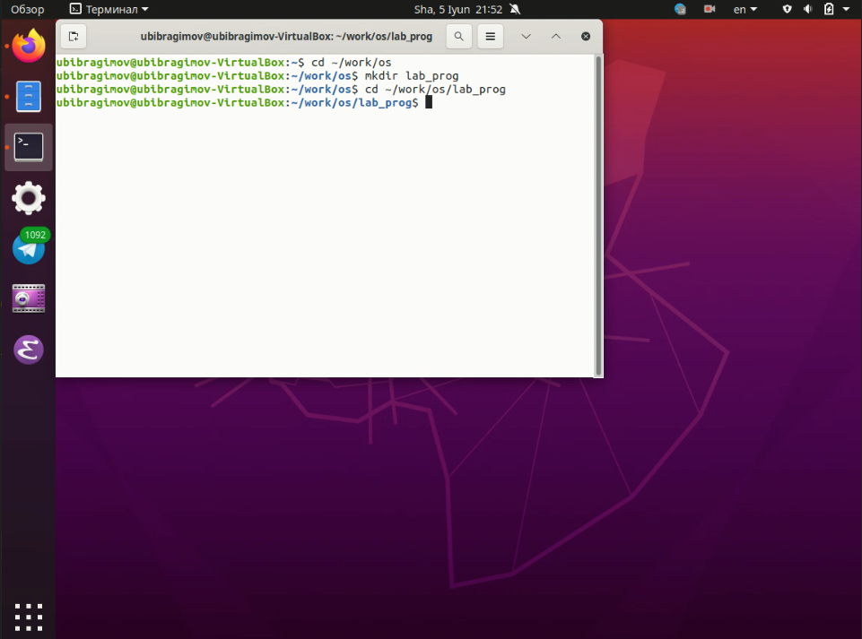
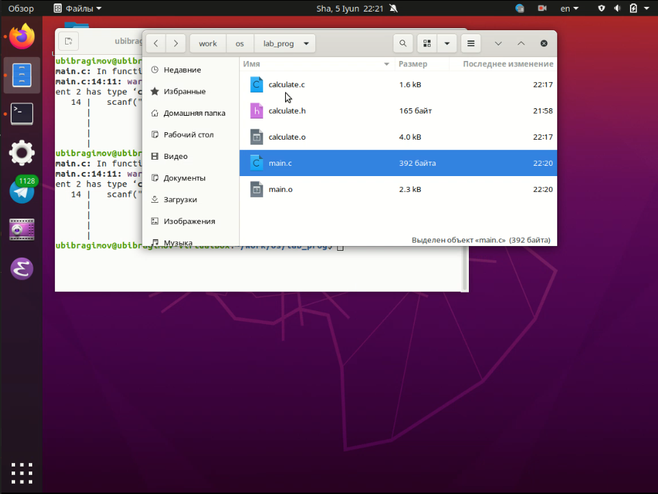
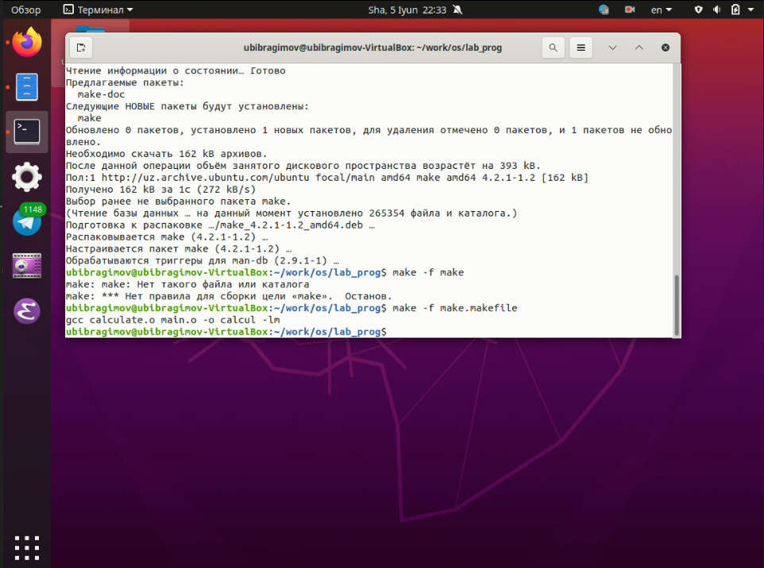
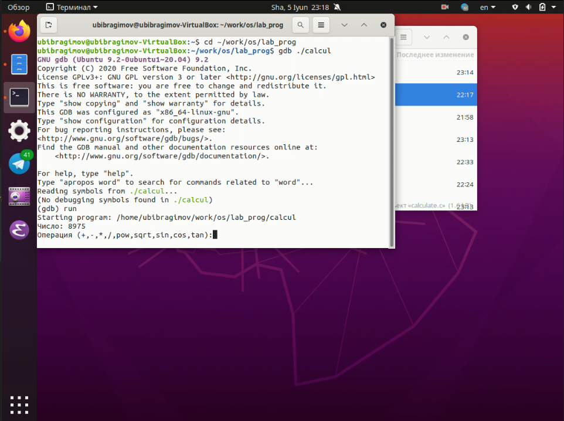
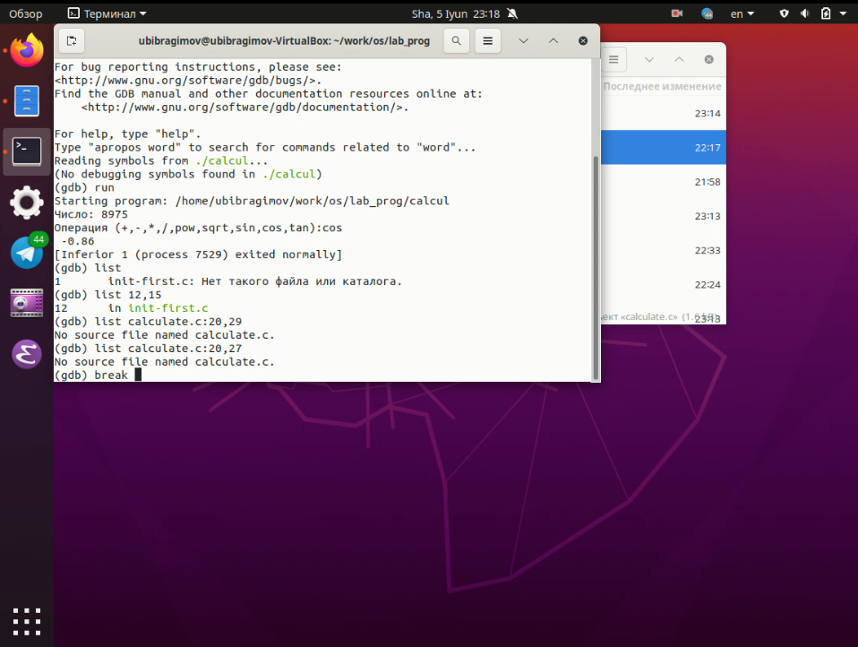
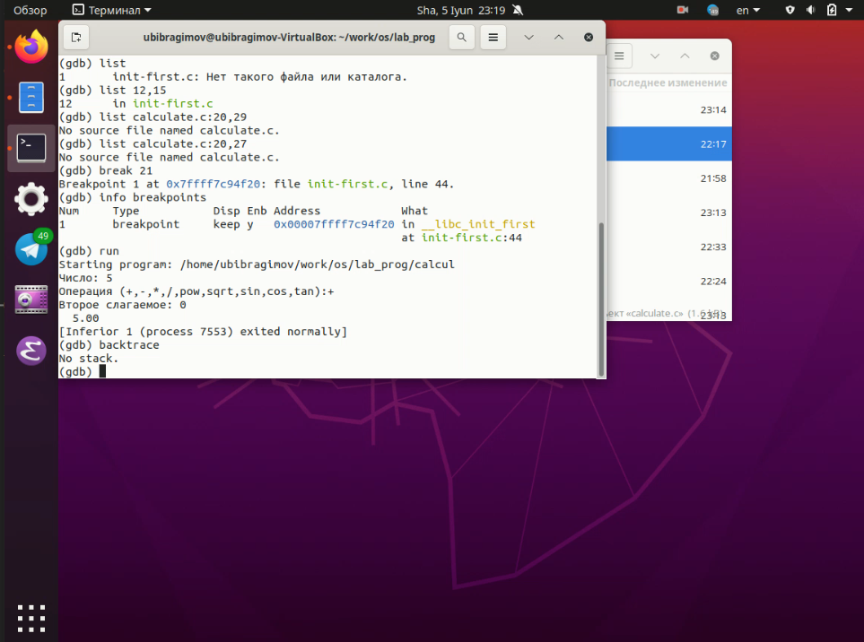
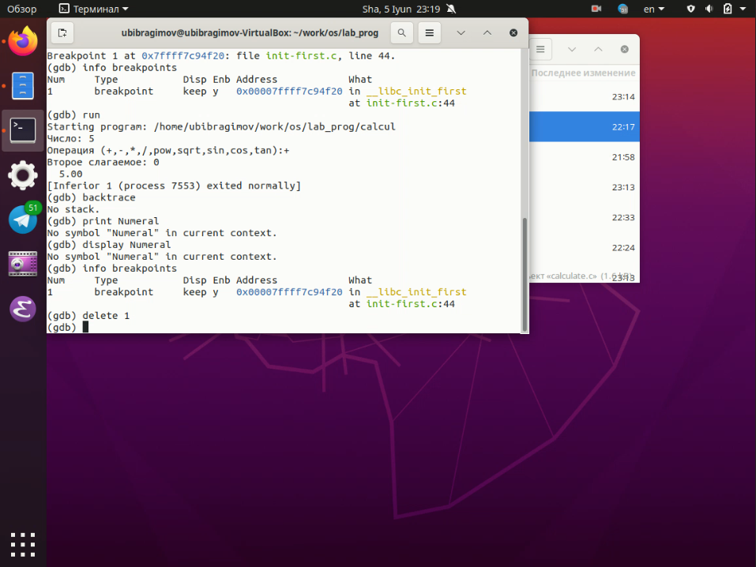
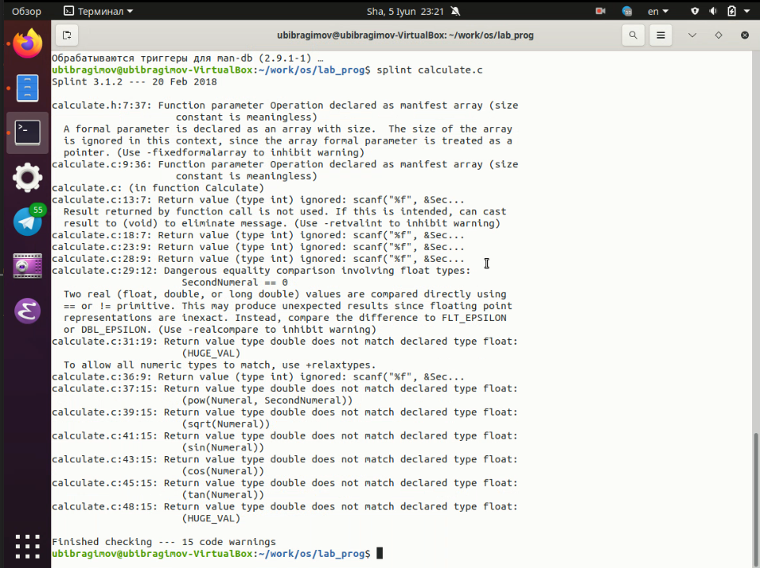
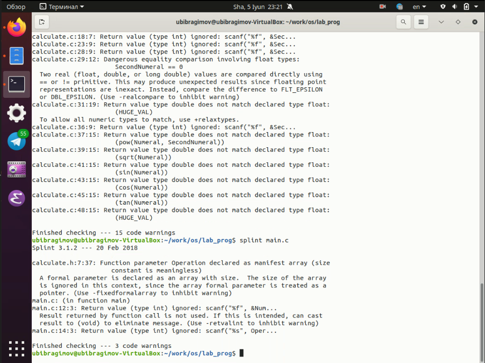

---
# Front matter
lang: ru-Ru
title: "Отчёта по лабораторной работе №14"
author: "Ибрагимов Улугбек Ботырхонович"

# Formatting
toc-title: "Содержание"
toc: true # Table of contents
toc_depth: 2
lof: true # List of figures
lot: true # List of tables
fontsize: 14pt
linestretch: 1.5
papersize: a4paper
documentclass: scrreprt
polyglossia-lang: russian
polyglossia-otherlangs: english
mainfont: PT Serif
romanfont: PT Serif
sansfont: PT Sans
monofont: PT Mono
mainfontoptions: Ligatures=TeX
romanfontoptions: Ligatures=TeX
sansfontoptions: Ligatures=TeX,Scale=MatchLowercase
monofontoptions: Scale=MatchLowercase
indent: true
pdf-engine: lualatex
header-includes:
  - \linepenalty=10 # the penalty added to the badness of each line within a paragraph (no associated penalty node) Increasing the value makes tex try to have fewer lines in the paragraph.
  - \interlinepenalty=0 # value of the penalty (node) added after each line of a paragraph.
  - \hyphenpenalty=50 # the penalty for line breaking at an automatically inserted hyphen
  - \exhyphenpenalty=50 # the penalty for line breaking at an explicit hyphen
  - \binoppenalty=700 # the penalty for breaking a line at a binary operator
  - \relpenalty=500 # the penalty for breaking a line at a relation
  - \clubpenalty=150 # extra penalty for breaking after first line of a paragraph
  - \widowpenalty=150 # extra penalty for breaking before last line of a paragraph
  - \displaywidowpenalty=50 # extra penalty for breaking before last line before a display math
  - \brokenpenalty=100 # extra penalty for page breaking after a hyphenated line
  - \predisplaypenalty=10000 # penalty for breaking before a display
  - \postdisplaypenalty=0 # penalty for breaking after a display
  - \floatingpenalty = 20000 # penalty for splitting an insertion (can only be split footnote in standard LaTeX)
  - \raggedbottom # or \flushbottom
  - \usepackage{float} # keep figures where there are in the text
  - \floatplacement{figure}{H} # keep figures where there are in the text
---

## Титульный лист
Отчёт по лабораторной работе №14
Ибрагимов Улугбек Ботырхонович

## Цель работы
пПриобрести простейшие навыки разработки, анализа, тестирования и отладки приложений в ОС типа UNIX/Linux на примере создания на языке программирования C калькулятора с простейшими функциями.

## Ход работы:
## 1. В домашнем каталоге создайте подкаталог~/work/os/lab_prog

## 2. Создайте в нём файлы: calculate.h, calculate.c, main.c. Это будет примитивнейший калькулятор, способный складывать, вычитать, умножать и делить, возводить число в степень, брать квадратный корень, вычислять sin, cos, tan. При запуске он будет запрашивать первое число, операцию,второе число. После этого программа выведет результат и остановится

## 3. Выполните компиляцию программы посредством `gcc`: `gcc -c calculate.cgcc -c main.cgcc calculate.o main.o -o calcul -lm`
## 4. При необходимости исправьте синтаксические ошибки!
## 5. Создайте Makefile со следующим содержанием
В нём указаны :
+ CC - тип компилятора
+ CFLAGS - опции для компиляции главного файла
+ Компиляция каждого зависящего файла с расширением `%name%.o`
+ Сборщик всей программы называется `"calculate"`
+ Команда `clean`, для быстрого удаления всех файлов в том числе и временных

## 6. С помощью `gdb` выполните отладку программы `calcul` (перед использованием `gdb` исправьте `Makefile`):

## 6. С помощью утилиты `splint` попробуйте проанализировать коды файлов `calculate.c` и `main.c`

## Вывод
В ходе выполнения Лабораторной работы №14, были приобретены навыки по разработке, анализу, тестированию и отладки приложений в Linux

## Контрольные вопросы
1. Можно использовать стандартные команды для получения справки - `man gcc`, `man make`, `man gdb` ну или вместо утилиты `man` использовать команду `--help`
2. Основные этапы разработки приложений в Unix:
`Создание исходного кода (написание в IDE) -> Сохранение промежуточных файлов или альтернативных веток разработки исходного кода -> Компиляция исходных файлов или их интерпритация в зависимости от выбранного языка программирования и/или системы сборки проектов -> Тестирование проекта который был собран -> Запись в соответствующую ветку разработки Git (main или dev, по-умолчанию)`
3. Суффикс - нужен для определения расширения в контексте файловой системы или компилятора с помощью которого будет производиться компиляция или интерпретация исходного кода в работающую программу (например hello1.py компилируется только ipython, а вот hello2.c компилируется только gcc, Cmake)
4. Компилятор Си предназначен для компиляции внутренних файлов системы без полного скачивания программ, а просто скачав исходный код системных утилит и произвести с помощью встроенного компилятора компиляцию системных утилит
5. Утилита `make` - предназначена для упрощения разработки приложений, путем написания файла конфигурации который описывает пути компиляции для компилятора языка программирования
6. Можно использовать пример из лабараторной работы
7. Пошаговая отладка программ (трассировка) -  её суть заключается в пошаговом выполнении каждой строчки кода
8. Основные команды отладчика `gdb`:
+ `backtrace` - вывод на экран путь к текущей точке останова.
+ `break` - установить точку останова (строка или функция)
+ `clear` - удалить все точки останова в функции
+ `ontinue` - продолжить выполнение программы
+ `delete (n)` - удалить точку останова
+ `display` - добавить выражение в список выражений, значения которых отображаются при достижении точки останова программы
+ `finish` - выполнить программу до момента выхода из функции
+ `info breakpoints` - вывести на экран список используемых точек останова
+ `info watchpoints` - вывести на экран список используемых контрольных выражений
+ `list` - вывести на экран исходный код (в качестве параметра может быть указано название файла и через двоеточие номера начальной и конечной строк)
+ `next` - выполнить программу пошагово, но без выполнения вызываемых в программе функций
+ `print` - вывести значение указываемого в качестве параметра выражения
+ `run` - запуск программы на выполнение
+ `set[variable]` - установить новое значение переменной
+ `step` - пошаговое выполнение программы
+ `watch` - установить контрольное выражение, при изменении значения которого программа будет остановлена
9. Мои действия при отладке программ:
`Запустил Makefile -> Начал отладку (run) -> Вывел содержимое main файла -> Установил точку останова в main файле -> Продолжил выполнение (run) -> Использовал команды print & display для вывод промежуточных данных -> Удалил точку останова -> Закончил отладку`
10. Нейтральная реация компилятора, т.е. программных ошибок обнаружено не было
11. `cppcheck`, `splint`, `cscope` и другие
12. Проверка корректности аргументов и поиск ошибок и значений в программе которые могут быть улучшены, а также оценка всей программы